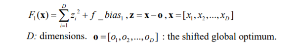
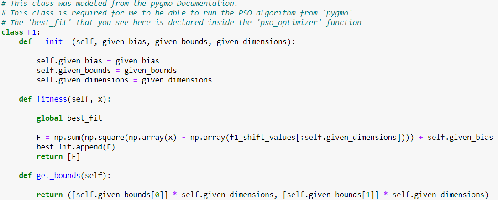
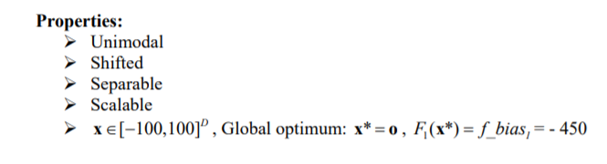
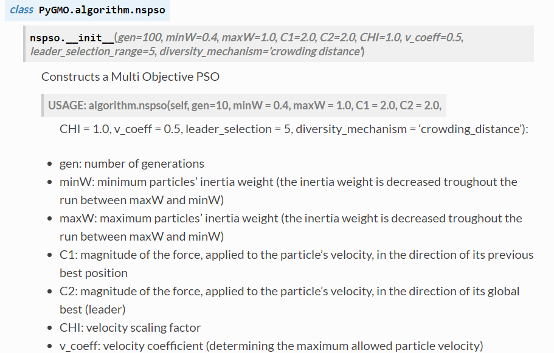
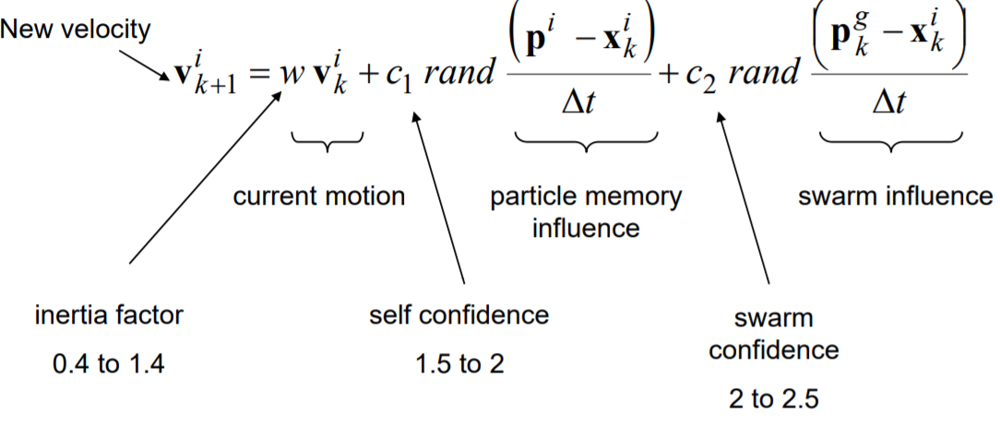
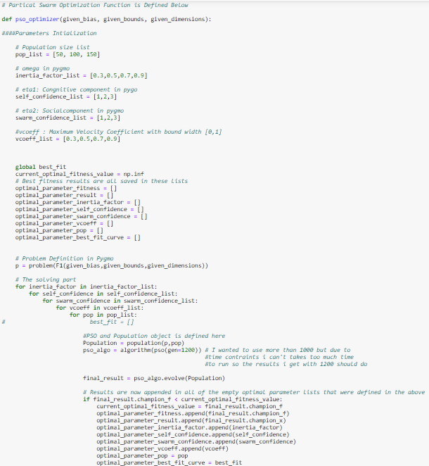
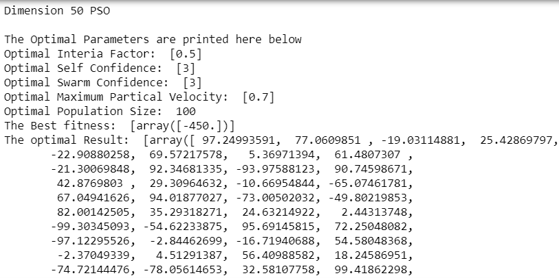
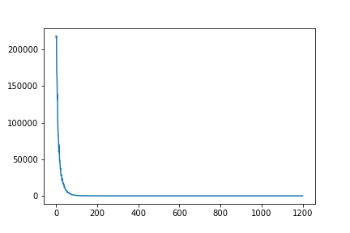
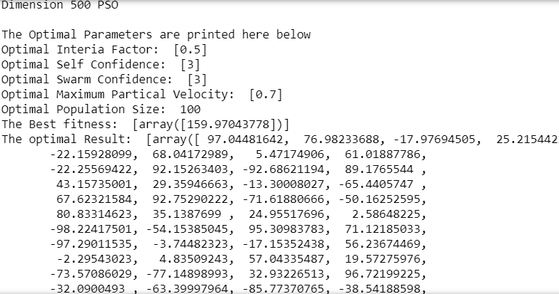

# F1 Shifted Sphere Function Optimization Using the 'Partical Swarm Optimization' Method

## Introduction and Setup
###### Figure 1 - Shifter Sphere Fucntion that will be Optimized

### Because of the Nature of the pygmo package, the only way to optimize the Shifted Sphere function using pso from pygmo is to make a Class. The 3 functions of this class are the primary internal functions that PSO will use when running the 'Shifted Sphere' function. 
###### Figure 2 - Class definition

#### The Class will contain an '__init__' self function consiting of the parameters 'given_bias' (-450 from the CEC2008 pdf), 'given_bounds' (-100 to 100 from the CEC2008 pdf) and 'given_dimensions' (50 and 500 which are specified in the Assignment guidelines). 
###### Figure 3 - Parameters

#### Next a 'fitness' function (pygmo package rules, the name of these functions can not be changed) is defined. Here the function takes 'self' and 'x' as parameters and returns the output of the shifted sphere function.
#### Thirdly the 'get_bounds' function is defined which takes self as a parameter and returns the bounds and the dimension specified in the problem. 

## Problem Definition 
### The Partical Swarm Function is defined here.(Figure 6) As you can see I have identified the important variables/parameters that are used for the pso                               function ("pso_algo = algorithm(pso(gen=1200, omega = inertia_factor, eta1= self_confidence, eta2 = swarm_confidence,max_vel=vcoeff,seed=4))" from the pygmo documentation. These are seen in Figure 4 below (omega, eta1, eta2 and max_velocity). I made a connection with the varibles of the true partical swarm equation (inertia factor, self confidence, swarm confidence, maximum velocity and population size ....given by Dr Amir from his lecture notes), Figure 5.
###### Figure 4 - Pygmo Documentation - Parameters Explained

###### Figure 5 - PSO Function and parameters

###### Figure 6 - 'pso_optimizer' Function defined and Solved

### All 5 parameters have 3 values each. A unique set of each variable will be run hence the function will run on 3^5 = 243 times and the best result will be given 

## Optimal Result according to the function for Dimension 50
#### Optimal Interia Factor: 0.5
#### Optimal Self Confidence: 3 
#### Optimal Swarm Confidence: 3
#### Optimal Maximum Partical Velocity: 0.7
#### Optimal Population Size:  100
#### The Optimal Result: 
       [ 97.24993591,  77.0609851 , -19.03114881,  25.42869797,
       -22.90880258,  69.57217578,   5.36971394,  61.4807307 ,
       -21.30069848,  92.34681335, -93.97588123,  90.74598671,
        42.8769803 ,  29.30964632, -10.66954844, -65.07461781,
        67.04941626,  94.01877027, -73.00502032, -49.80219853,
        82.00142505,  35.29318271,  24.63214922,   2.44313748,
       -99.30345093, -54.62233875,  95.69145815,  72.25048082,
       -97.12295526,  -2.84462699, -16.71940688,  54.58048368,
        -2.37049339,   4.51291387,  56.40988582,  18.24586951,
       -74.72144476, -78.05614653,  32.58107758,  99.41862298,
       -30.76381164, -64.78909695, -86.42220775, -38.12082259,
       -33.04804036, -24.76648649,  90.44136625,  43.86410221,
        55.86848707,  23.53173227]
###### Figure 7 -Results for dimension 50

###### Figure 8 - Convergence Curve, No. Iterations vs Fitness

### The Best fitness values is -450

## Optimal Result according to the function for Dimension 500
#### Optimal Interia Factor: 0.5
#### Optimal Self Confidence: 3 
#### Optimal Swarm Confidence: 3
#### Optimal Maximum Partical Velocity: 0.7
#### Optimal Population Size:  100
#### The Optimal Result:
97.04481642,  76.98233688, -17.97694505,  25.21544223,
       -22.15928099,  68.04172989,   5.47174906,  61.01887786,
       -22.25569422,  92.15263403, -92.68621194,  89.1765544 ,
        43.15735001,  29.35946663, -13.30008027, -65.4405747 ,
        67.62321584,  92.75290222, -71.61880666, -50.16252595,
        80.83314623,  35.1387699 ,  24.95517696,   2.58648225,
       -98.22417501, -54.15385045,  95.30983783,  71.12185033,
       -97.29011535,  -3.74482323, -17.15352438,  56.23674469,
        -2.29543023,   4.83509243,  57.04335487,  19.57275976,
       -73.57086029, -77.14898993,  32.93226513,  96.72199225,
       -32.0900493 , -63.39997964, -85.77370765, -38.54188598,
       -34.28369802, -24.38472311,  90.93424833,  42.54362583,
        54.29828577,  24.08217933,  30.04880828,  51.01148473,
       -72.17034158,  20.59524138,  80.49270126, -62.8371393 ,
        63.74546995, -87.13672635,  91.86298911, -36.91316551,
       -97.83292082,  52.30958888, -38.32727764,  43.1600921 ,
       -82.748084  ,  69.14263535,  42.94439829,  72.66995783,
        73.81967817,  54.06418808,  34.24799752,  79.72191863,
        63.23347616,  68.94728616,  28.03465651, -66.82994922,
        56.73359861,  45.80516334,  12.84249012,  44.20484819,
       -51.60160677,  -1.86071612, -15.46249337,  59.52449352,
        53.89363059, -52.62506029,  25.49035453, -54.13981105,
        23.96300097, -45.42406841,  98.75679982,  50.17421623,
        -2.9693032 ,  89.50682676, -28.34922908, -81.14311031,
        89.90725452,  37.42608099,  23.64352617,  79.04211491,
       -95.3782793 , -38.91288247,  92.73503873, -78.22356313,
        18.59647907,  -4.82282483,  44.27306035,  72.6211147 ,
       -63.80751624,  -7.30859004,  80.86508195, -94.94140097,
        62.32026884,  59.69521544, -38.26991739, -53.23664942,
        -0.19168625,  36.18834636,  89.32868049, -12.43368426,
        -0.94593602, -80.1713787 ,  11.68219089, -12.31990332,
       -63.27304166, -69.69069652,  85.32599686, -73.87784075,
        97.39416831,  36.57958938,  92.54927453,  55.0380536 ,
       -97.80901103, -34.65398449,   8.20031041, -38.02506916,
        32.9546326 , -31.44458883,  95.50895993, -30.24321581,
       -93.07357097,  61.51132283,  96.35281871, -37.63890343,
       -24.01244437,  48.5009027 , -11.13075054, -80.24740652,
        98.43082796,   8.01042637, -72.04698542, -74.13469123,
        73.05562029,  43.25155925,  98.83028016,  63.26301769,
        55.46999271,  52.42438407,  80.90184963, -80.06303832,
       -58.61447024,  69.82391727,  47.97514351, -17.7724702 ,
       -39.99213118,  -4.71181889, -71.22001698,  -1.17855214,
         6.07343098,   3.92135611, -52.33736121,  87.01653762,
         3.09403659,  -6.49251372,  55.85150274,  48.8267966 ,
        20.43162311, -87.50967168, -85.60305211,  28.56014405,
        75.97049685, -12.71947628,  40.87920546, -86.25945368,
       -96.20207001,   0.30985564,  74.58972968,  61.65033527,
        61.68177196, -61.10683906,  42.48538221, -56.407171  ,
        57.03411693, -65.41108718, -59.19810156,  -6.35389811,
       -85.61846942,  20.65919757, -63.03640685,  86.90089274,
       -37.61743897,  -7.53578062,  65.08610452, -39.03377156,
        42.09693257, -86.4994379 ,  49.07723212,  -5.11465549,
        89.0583042 , -96.29070968, -88.73869701,  47.82015501,
        26.10722248,  87.24176745,  -7.56373752,   3.46390071,
       -14.77466116, -14.97079691, -22.90773499,  70.4059358 ,
        64.25460323,  81.33443215,  66.62066565,  73.84149093,
        54.49081788, -13.25751131, -13.24184926, -54.63736695,
       -97.21155729, -22.67098019,  68.85686717, -43.10409513,
       -42.71904838, -34.75975052,  -4.87317729, -52.25002036,
        91.83237021, -38.98704454,  52.35925551,  78.06950875,
       -47.49830484, -70.52148621, -31.91362219,  46.56207243,
       -93.01047052,   9.64161836,  12.79387563,  33.39182102,
        17.55760942,  36.8052438 ,  52.71641077,  79.47677134,
        92.31155587,  82.41916911, -64.66162023,  96.16224627,
        80.02531267, -93.35695076, -43.65709714, -61.93300161,
        21.79323884, -56.02053385,  99.39968739, -95.70874371,
       -11.98120946, -69.84085736,  24.61780073,  53.67475704,
       -44.91844486,   4.3937107 , -37.68263357, -63.14627764,
        55.49892988,  61.54862101,  45.08627052, -91.2327421 ,
        22.66167038, -33.41684346,  16.54127818,  81.84124233,
        -0.46180922, -15.93347767,  60.54043028,  76.47862093,
         1.22901634, -21.40157503,  85.19716228, -44.17983038,
        56.27004252,  46.43664692,  83.16837021, -79.24962255,
        78.53528097,  20.50208268, -97.15535408, -50.17158747,
       -76.6284912 ,  76.63318386,  63.03737427,  53.73333663,
        61.67937602,  37.48073876,  25.15656793, -25.48824502,
       -58.10068693, -44.07470191,  -4.00095992, -19.23440683,
        41.59378097, -35.8559658 , -88.86591551,  54.74968988,
         9.94133367, -86.37940134,   1.38245562,  67.18880993,
        -6.58191504,  55.89151529,  -1.4902929 ,  36.5534573 ,
        95.28734672, -29.93774269,  23.23618044,   3.90679358,
        61.37704613,  -2.96936911,  46.3429544 ,  40.69540012,
        66.62783783, -97.30307571, -88.95050409,  -0.40666506,
       -41.21582688, -95.61077075,  60.06354542, -85.13405633,
       -38.73894359, -33.50291642,  65.04373664, -97.34715912,
        -1.41933445,  23.39283118, -25.49776051, -60.36251822,
        78.5843142 ,  95.9275975 ,  84.6254901 , -21.32256983,
        33.00876622,   9.80662721, -58.19358851, -39.11772546,
       -98.97645248, -98.77879357,  94.62500921,  61.34664802,
        54.01323373,  81.21617656, -74.23401936, -81.07650156,
        11.70028623, -98.77280543, -73.88918773, -86.96392149,
        53.57327559, -86.29707995,  44.74695347, -73.05826943,
        21.4140323 ,  -5.50263509,   2.51706043, -30.68074537,
       -82.92214155, -49.31855653,   4.9937469 , -70.6405031 ,
       -75.38266516,   0.57092503, -43.26469155, -74.75118074,
         0.42974418, -24.28130489, -46.58015773,  91.32677265,
        -7.82049358, -51.00492253,  66.13739572, -39.05985244,
       -94.79598985,  95.94102684,  -4.0574026 ,  21.92744463,
         3.16951933,  95.22456368, -50.36805799,  31.51459193,
       -71.61667289, -19.55942853, -71.79133093, -30.2382896 ,
         9.64091832, -89.97459121, -53.5511584 , -20.96354111,
       -74.36610607, -11.14614984, -88.64817074,  98.07772921,
        38.43471845,  22.62050534,  23.35152082,  65.88758805,
        95.14535487, -12.23982753,  71.26245503, -20.43794515,
       -15.85227201,  76.50652459, -30.48761369,  62.62409367,
        98.92826499,  52.77973888,  69.4594756 ,  32.17348571,
       -45.89230742, -51.47715117, -15.11698492,  18.98403742,
       -15.14555796,  54.11552678, -93.59791156,  38.00943668,
        51.16761476,  90.44956454, -21.96866388, -88.71557793,
       -24.14287283,  30.98295121,  40.3867839 , -79.44297525,
        88.90197935,   7.06168936,  82.65844768, -38.51449402,
        45.94794695, -22.84018879,  80.55349597, -86.38847821,
       -47.52028692,  25.65664727,  36.8450364 ,  46.20287699,
        87.71789889,  22.9369813 ,  47.46934836,  28.62785414,
       -66.25448526, -45.79357639,  62.34485155, -19.69154167,
        32.76872273, -43.3206576 ,  92.77492015,  14.79578523,
        92.41893685,   1.84642718,  71.92053864, -55.21017886,
       -51.99597145,  78.70939871,  40.32614212,  92.7085584 ,
        -6.81240496,  50.16555069,  35.62221597, -92.65229792,
       -28.69751176, -84.30323538, -86.34887831,  53.37535776,
        23.69964517,   7.0907521 ,  96.53312118, -37.56394953,
       -64.49239845,  13.13160006,  -6.99388469, -21.20190412,
       -93.47532075, -30.42449536,  94.4728107 ,  14.20575856,
        53.37524975,  26.39691387,  45.93908472, -69.57269512,
       -16.21398448, -85.87390517,  75.88883394,  66.45441202]
       
###### Figure 9 - Results for Dimension 500

###### Figure 10 - Convergence Curve, No. Iterations vs Fitness

### Best Fitness: 159

