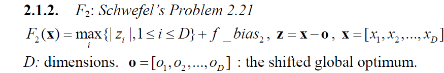
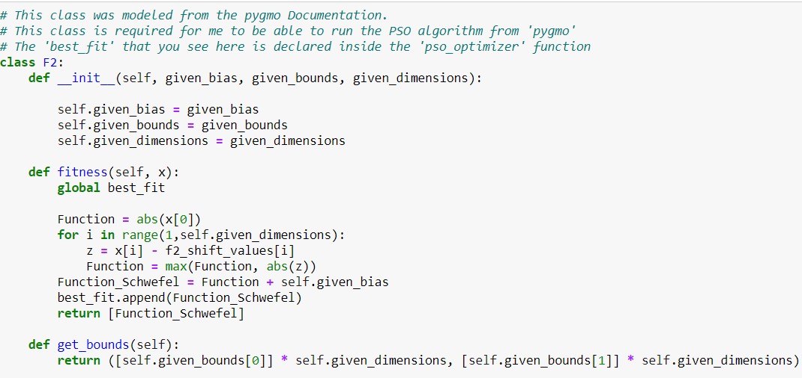
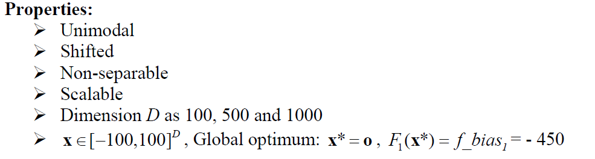
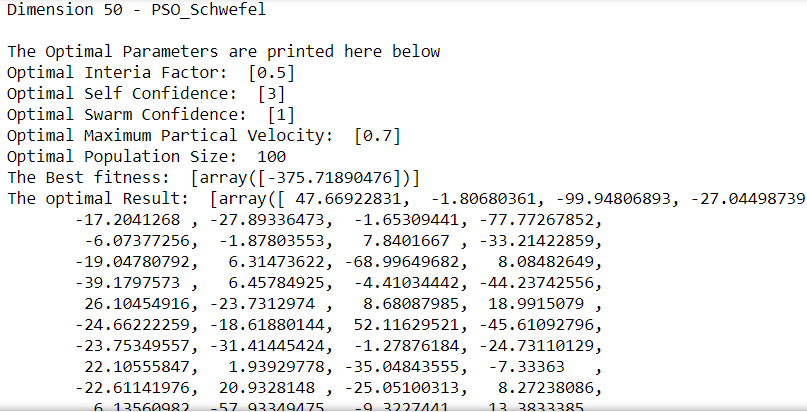
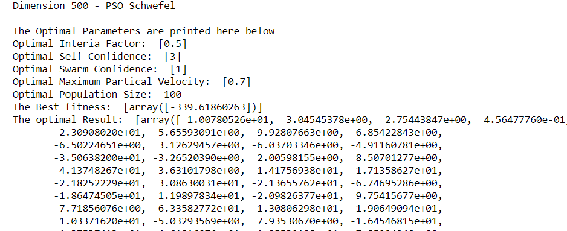

# F2 Shifted Schwefel Function Optimization Using the 'Partical Swarm Optimization' Method
## Introduction and Setup
###### Figure 1 - Shifted Schwel Fucntion that will be Optimized

### The 3 functions of this class are the primary internal functions that PSO will use when running the 'Shifted Schwefel' function. 
###### Figure 2 - Class definition

###### Figure 3 - Parameters

### The creation of the pso_optimizer and the running method is the same as the one thorooughly described in the Shifted Schwefel ReadMe

## Optimal Result according to the function for Dimension 50
#### Optimal Interia Factor: 0.5
#### Optimal Self Confidence: 3 
#### Optimal Swarm Confidence: 5
#### Optimal Maximum Partical Velocity: 0.7
#### Optimal Population Size:  100
#### The Optimal Result: 
        47.66922831,  -1.80680361, -99.94806893, -27.04498739,
       -17.2041268 , -27.89336473,  -1.65309441, -77.77267852,
        -6.07377256,  -1.87803553,   7.8401667 , -33.21422859,
       -19.04780792,   6.31473622, -68.99649682,   8.08482649,
       -39.1797573 ,   6.45784925,  -4.41034442, -44.23742556,
        26.10454916, -23.7312974 ,   8.68087985,  18.9915079 ,
       -24.66222259, -18.61880144,  52.11629521, -45.61092796,
       -23.75349557, -31.41445424,  -1.27876184, -24.73110129,
        22.10555847,   1.93929778, -35.04843555,  -7.33363   ,
       -22.61141976,  20.9328148 , -25.05100313,   8.27238086,
         6.13560982, -57.93349475,  -9.3227441 ,  13.3833385 ,
       -32.68208921,  -9.04335848,  23.40366329, -75.34742272,
        36.0246104 ,  -9.18411323
        
###### Figure 4 - Results for Dimension 50

###### Figure 5 - Convergence Curve, No. Iterations vs Fitness

### The Best fitness values is -375.71890476

## Optimal Result according to the function for Dimension 500
#### Optimal Interia Factor: 0.5
#### Optimal Self Confidence: 3 
#### Optimal Swarm Confidence: 1
#### Optimal Maximum Partical Velocity: 0.7
#### Optimal Population Size:  100
#### The Optimal Result:
1.00780526e+01,  3.04545378e+00,  2.75443847e+00,  4.56477760e-01,
        2.30908020e+01,  5.65593091e+00,  9.92807663e+00,  6.85422843e+00,
       -6.50224651e+00,  3.12629457e+00, -6.03703346e+00, -4.91160781e+00,
       -3.50638200e+01, -3.26520390e+00,  2.00598155e+00,  8.50701277e+00,
        4.13748267e+01, -3.63101798e+00, -1.41756938e+01, -1.71358627e+01,
       -2.18252229e+01,  3.08630031e+01, -2.13655762e+01, -6.74695286e+00,
       -1.86474505e+01,  1.19897834e+01, -2.09826377e+01,  9.75415677e+00,
        7.71856076e+00,  6.33582772e+01, -1.30806298e+01,  1.90649094e+01,
        1.03371620e+01, -5.03293569e+00,  7.93530670e+00, -1.64546815e+01,
        1.37537413e+01,  4.61816876e+01,  1.25539108e+01, -7.85224248e+00,
        2.60624167e+01, -1.36900119e+01,  1.43866485e+01, -7.80017737e+00,
       -1.72880379e+00,  9.22471772e+00, -8.65986996e+00,  1.21731623e+01,
       -2.95763625e+01, -7.95906845e+00,  5.45713345e+00, -1.46803122e+01,
       -1.15350015e+01,  9.49631783e+00,  5.59995844e+01, -1.33572480e+01,
       -2.73129097e+01,  8.49033381e+00,  1.44873868e+01,  2.24405449e-01,
       -9.96717746e+01,  1.69026664e+01,  1.35410147e+01,  3.39277821e+01,
        5.04092766e+00, -3.14842016e+01, -2.43842109e+01, -1.30796707e+00,
       -3.04370512e+01,  1.74756111e+01, -2.98199862e+01,  2.26138301e+01,
        4.65018031e+00, -2.15564885e+00,  5.55635058e+00, -9.46334365e-03,
        1.20218415e+01, -9.13772754e+01, -7.88996428e-01, -2.46054116e+01,
        1.35731431e+01,  7.39874478e+00, -1.50685921e+01,  1.30226309e+01,
       -1.93551152e-01, -1.00350760e+01, -3.62945870e+00, -2.65046613e-01,
       -3.79882858e+01,  3.38710124e+00,  7.41311066e+00, -1.68410746e+01,
       -1.45244683e+01,  1.17369102e+00, -6.84104311e+00, -1.30748251e+01,
       -7.55781297e+01,  2.59374484e+00, -9.51277659e+00, -3.13346523e+01,
        5.63592044e+00,  4.46582811e+00,  5.56029532e+00,  9.98975402e-01,
        2.63482526e+01, -4.43214343e+00,  1.26600641e+01, -1.04665313e+01,
        8.34871796e+00,  6.08772137e+00, -1.42458992e+01,  1.10283875e+01,
        2.56779936e+01,  2.22143734e+00, -1.39498361e+01,  1.57814724e+01,
       -1.50818262e+00,  1.10788614e+01, -8.03694634e-01, -5.41508232e+00,
        1.60011818e+01, -9.79853969e+01,  3.85663402e+01, -6.39893625e+00,
        2.75498511e+00,  2.60403916e+01,  4.05353023e+00,  1.61710852e+01,
        1.25118091e+01, -8.38972950e+00, -1.83559006e+01, -9.33468720e+00,
       -8.78597268e+00,  2.62267429e+01,  1.38732338e-01, -7.58982122e+00,
       -2.78452664e+01, -8.13468749e+00,  7.34941124e+00,  6.93302851e+00,
       -2.19812954e+01, -5.57275986e+00, -1.35972211e+01,  2.78879259e+01,
        1.00504647e+01, -1.70859897e+01,  2.06502784e+01, -2.96628274e+00,
        1.55158035e+01,  8.65603769e+01,  1.20065597e+01, -3.07652748e+01,
        2.54881584e+01, -3.75874679e+00,  8.21920605e+00,  1.11140079e+01,
        2.97800196e+01, -5.67821764e-02, -2.12817431e+01,  7.58161658e+00,
       -1.82504726e+01,  1.69830072e+00,  1.48308932e+01,  1.18795076e+01,
       -1.78823750e+00, -8.23055088e-01,  1.38855737e+00,  8.50630606e+00,
        1.17549990e+01, -3.71534111e+00, -2.32906013e+01, -9.94044197e+00,
       -1.10416063e+01,  4.03768528e+00, -1.78114518e+01, -1.38845355e+01,
       -1.39668023e+01,  2.13502556e+00, -1.43115822e+01,  1.62970035e+00,
       -1.56094679e+01,  6.34096367e+00,  1.72628136e+01, -7.70500544e+00,
       -7.21471438e+01,  3.66159304e+00,  1.02894871e+00, -2.22165657e+01,
        1.26735112e+01, -1.16361259e+01,  2.05308520e+00,  2.03868795e-01,
       -5.25496366e+00,  1.25264129e+01,  9.78735561e+00,  7.65524029e+00,
        2.23472713e+01,  2.41361102e+01,  1.49735930e+01, -1.13906743e+01,
        1.90314708e+01,  7.06314017e+00, -1.60330246e+00, -6.40170946e+00,
       -4.26618033e+00, -1.04191228e+00,  5.79138131e+00, -4.95286433e+00,
        2.29502709e+01, -1.97497222e+00, -2.85650638e+00, -1.56292311e+01,
        4.76014416e+01, -3.94358444e+00,  2.13873431e+01, -7.20916438e-01,
       -1.10434884e+01,  4.78500764e+00,  2.29952636e+01,  9.45064576e+00,
        1.21803252e+01, -2.60883889e+00,  3.85194027e+01,  8.59542493e+00,
        5.97854590e+00,  1.57134338e+00, -1.24190621e+01,  1.08634185e+01,
        1.50113972e+01,  2.74033537e+00,  8.97157677e+00, -1.90522536e+01,
       -6.40141167e+00, -2.07589416e+01,  1.36532195e+00, -2.54731273e+01,
        2.02960375e+00,  5.61826969e+00, -1.44157689e+01,  1.91996300e+01,
        8.71629391e+01, -1.71861375e+01,  9.13138026e-01, -2.82792517e+00,
        1.43911268e+01,  9.46316442e+00,  1.02199772e+01, -5.75027190e+01,
        3.29486563e+01,  1.17696637e+01,  7.44345093e+01,  6.08384925e+00,
       -5.41402103e+01,  2.87518135e+01,  2.88772051e+01, -1.00996794e+01,
        3.25909867e+01,  6.50014048e+00,  9.22272482e+00,  9.71435151e+00,
        5.54604429e+00,  3.37816065e+01,  8.91688927e+00,  9.80699340e+00,
       -9.74672767e+00, -2.51455335e+01, -1.22406847e+01,  8.16446604e+00,
        1.00084689e+01, -1.10121690e+01,  4.40636140e+00, -1.21262459e+01,
       -6.81130324e+00, -7.60923241e+01, -1.58742001e+01, -3.31262126e+01,
       -1.74476834e+01, -1.59391107e+01,  1.70415212e+01,  8.86167913e+01,
       -6.32686283e+00,  1.41553604e+00,  2.05416057e+01,  4.53575081e+01,
       -2.42034428e+01,  1.27096940e+00,  2.85479206e-01,  6.49477680e+00,
        3.04646774e-01,  1.34883111e+01, -7.78703131e+01,  5.03309995e+01,
        1.03396073e+01,  9.71102629e+00, -2.93922369e+01,  1.76687186e+01,
        1.12374996e+01, -1.66223505e+01, -6.42203078e+00, -1.25420200e+01,
       -5.74842317e+00,  2.81223146e+01,  2.28998746e+01, -7.00709172e+00,
       -1.18358310e+01,  5.59316066e+00,  3.59943810e+00,  3.78984468e+00,
       -1.17173086e+01, -5.39445290e+00, -1.80747893e+00,  1.29889321e+01,
       -4.69525056e+01, -1.41259282e+01, -5.10019198e+00,  1.32715760e+01,
       -2.77583343e+01,  2.09011348e+01, -1.61498192e-01, -8.89686922e+00,
        4.13545870e+00, -1.35355729e+00,  1.50751162e+00, -3.36275546e+01,
        4.98969658e+00, -1.98593750e+01, -6.84630008e+01, -2.23260129e+01,
        9.95590078e+01, -2.01332840e+00,  1.79317508e+00, -1.43693003e+01,
       -2.44022048e+01,  3.59454867e+01, -5.35434795e+00, -8.33242469e+00,
       -3.29481614e+01, -8.88746948e+00, -2.54824091e+01, -1.73799423e+01,
        1.98498535e+01, -3.74391934e+00, -5.16388138e+01,  6.21383506e+00,
       -7.54839652e+00,  1.04842817e+01,  2.15579024e+01, -7.66969139e+01,
        1.22142416e+01, -3.22986680e+01, -9.91644664e+01,  1.41913531e+01,
       -7.16226380e+00, -4.22481033e+01, -1.69325419e+01, -1.02976405e+01,
       -1.24331755e+01,  2.97597724e+01, -1.50062868e+00,  4.77272049e+00,
       -1.10914216e+00, -8.68128985e-01, -3.07668540e+00, -3.82341977e+01,
        4.62469966e+00, -7.32211236e+00,  2.18956145e+01, -4.65658181e+00,
        2.90136051e+01, -2.07792506e+01,  6.45013851e+00, -2.11528731e+01,
        1.67565049e+01, -1.64033671e+01,  1.42208872e+01,  1.80102334e+01,
       -3.41595391e+01,  2.06735505e+01, -2.32109059e+01, -7.43187489e+00,
       -1.30919547e+01, -5.91687780e+00,  9.67943030e+00, -1.93380659e+01,
        2.83066458e+01, -2.61791973e+01, -1.54721178e+01,  1.06110837e+00,
        3.98020056e+00, -5.85467265e+00, -1.05534889e+01, -2.05380292e+01,
        5.93336020e+00,  3.06213848e-01,  1.14058540e+01,  1.66962422e+01,
        1.32920377e+01, -2.26723691e+00, -1.94433759e+00,  3.01642054e+01,
       -1.02872408e+01,  1.18045014e+01, -8.23239264e+00, -1.21629259e+01,
        1.00973884e+01, -1.00039233e+01,  1.99898673e+01,  2.34604396e+01,
        1.68065562e+01,  1.55743487e+01, -2.83423568e+00,  1.18334971e+01,
       -9.69706553e+01, -7.27258919e+00,  1.00940005e+01,  1.47027690e+01,
        1.55391200e+01, -3.59590420e+00, -1.72332926e+01, -1.73928442e+01,
        2.89141612e+01, -1.29051918e+01, -4.40209351e+01, -1.78054207e+01,
       -1.63590368e+01,  1.88039139e+01, -2.92420084e+00, -2.65895475e+00,
       -2.65623018e+00,  1.52553033e+01, -1.05873278e+01,  5.46211028e-01,
       -1.39454782e+01, -3.50787954e+01,  9.19550904e+00,  1.09556240e+00,
       -2.77778357e+01,  3.82225715e+00, -4.05260414e+00, -4.83894739e+00,
        2.97586672e+01,  2.37615181e+00, -6.36860684e+00,  2.82028520e+00,
       -1.85101408e+01, -2.67301024e+01, -5.55102551e+00, -2.04011080e+01,
        6.23026578e+00, -5.57091857e+01, -1.77177630e+01, -2.50272282e+01,
       -1.48152344e+00,  1.13242928e+01,  2.59104055e+01, -3.66759840e+01,
        2.32465568e+00,  3.89349590e+01,  3.30579044e-01,  6.44027359e-01,
       -3.89810659e+01,  5.01412510e+00,  2.81689937e+00,  7.58978630e-01,
       -2.27843230e+01,  8.28760016e+00,  4.60697796e+01, -8.73910568e+00,
       -1.10240862e+01,  3.87912247e+01,  7.64667523e+00,  2.58401950e+01,
       -2.60235333e+01, -2.22461514e+01,  4.15161244e+00,  2.60429431e+01,
        1.84673586e+01,  5.96838184e+00, -1.02744861e+01,  4.68351541e+00,
       -2.75547626e+00,  3.09312157e+00,  1.54634756e+01, -3.39214104e+00,
       -8.13276692e+00, -1.81785721e+00,  8.23295099e+01,  1.50383366e+01,
       -6.36926318e+00,  3.68790423e+00, -4.81976210e+00, -5.01875763e-01,
       -4.66388222e+00, -1.90216695e+01,  8.62547826e+00,  1.44069672e+01,
        5.68252027e+00,  2.95221172e+00, -6.43331132e+00, -5.95838765e+00
        
###### Figure 6 - Results for Dimension 500

###### Figure 7 - Convergence Curve, No. Iterations vs Fitness

### The Best fitness values is -339.61860263
