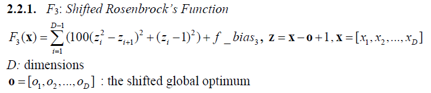
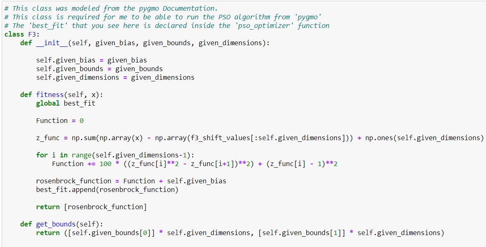
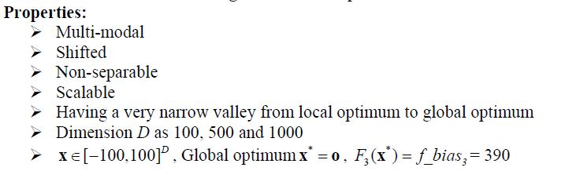
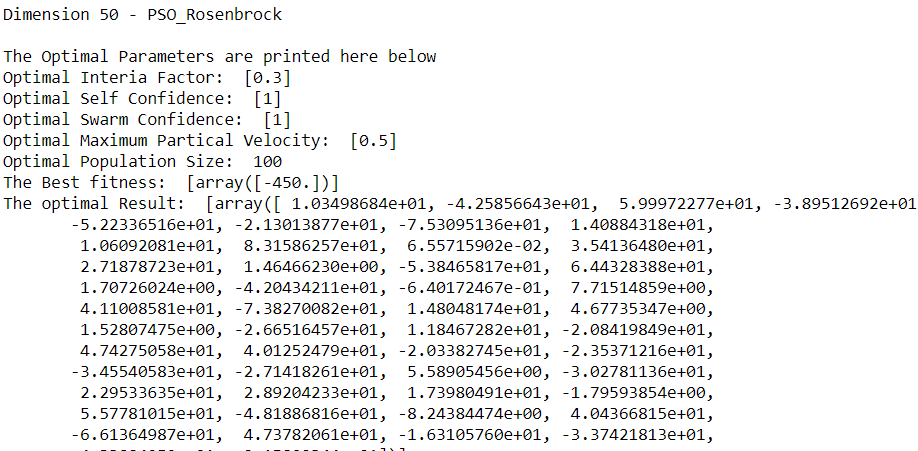
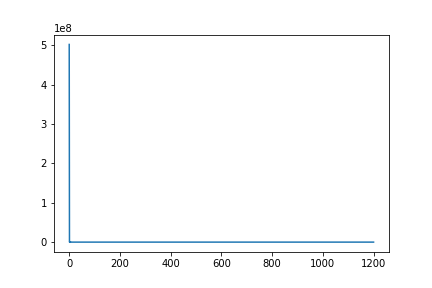
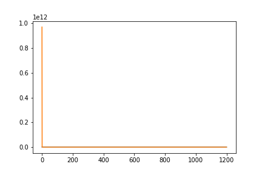

# F3 Shifted Rosenbrock’s Function Optimization Using the 'Partical Swarm Optimization' Method
## Introduction and Setup
###### Figure 1 - Shifted Rosenbrock's Fucntion that will be Optimized

### The 3 functions of this class are the primary internal functions that PSO will use when running the 'Shifted Rosenbrock' function. 
###### Figure 2 - Class definition

###### Figure 3 - Parameters

### The creation of the pso_optimizer and the running method is the same as the one thorooughly described in the Shifted Sphere ReadMe

## Optimal Result according to the function for Dimension 50
#### Optimal Interia Factor: 0.3
#### Optimal Self Confidence: 1 
#### Optimal Swarm Confidence: 1
#### Optimal Maximum Partical Velocity: 0.5
#### Optimal Population Size:  100
#### The Optimal Result: 
        1.03498684e+01, -4.25856643e+01,  5.99972277e+01, -3.89512692e+01,
       -5.22336516e+01, -2.13013877e+01, -7.53095136e+01,  1.40884318e+01,
        1.06092081e+01,  8.31586257e+01,  6.55715902e-02,  3.54136480e+01,
        2.71878723e+01,  1.46466230e+00, -5.38465817e+01,  6.44328388e+01,
        1.70726024e+00, -4.20434211e+01, -6.40172467e-01,  7.71514859e+00,
        4.11008581e+01, -7.38270082e+01,  1.48048174e+01,  4.67735347e+00,
        1.52807475e+00, -2.66516457e+01,  1.18467282e+01, -2.08419849e+01,
        4.74275058e+01,  4.01252479e+01, -2.03382745e+01, -2.35371216e+01,
       -3.45540583e+01, -2.71418261e+01,  5.58905456e+00, -3.02781136e+01,
        2.29533635e+01,  2.89204233e+01,  1.73980491e+01, -1.79593854e+00,
        5.57781015e+01, -4.81886816e+01, -8.24384474e+00,  4.04366815e+01,
       -6.61364987e+01,  4.73782061e+01, -1.63105760e+01, -3.37421813e+01,
       -4.33884959e+01,  2.15802344e+01
        
###### Figure 4 - Results for Dimension 50

###### Figure 5 - Convergence Curve, No. Iterations vs Fitness

### The Best fitness values is -450

## Optimal Result according to the function for Dimension 500
#### Optimal Interia Factor: 0.3
#### Optimal Self Confidence: 1
#### Optimal Swarm Confidence: 1
#### Optimal Maximum Partical Velocity: 0.5
#### Optimal Population Size:  100
#### The Optimal Result:
        -3.33176660e+01, -1.33662928e+01,  2.42690469e+01, -5.89595670e+01,
        5.45621721e+01,  6.76449735e+01, -8.65483129e+00, -1.25644630e+01,
        6.79061659e+01,  2.54076985e+01,  1.65774461e+00, -6.63745458e+01,
       -2.26116935e+01, -5.20435370e+01, -4.20071202e+01,  2.55670071e+01,
       -7.51156388e+00,  3.65114461e+01,  3.35063314e+01, -1.07659655e+01,
       -4.97369666e+01, -6.16685815e-01,  2.33497568e+00,  7.48290108e+01,
        4.46433884e+01,  7.30168705e+01, -1.35961679e+01,  4.68390897e+01,
        4.02414724e+01, -1.83043616e+01,  1.08268761e+01, -3.29996837e+01,
        3.50846355e+01, -6.26443698e+00,  2.98322785e+01, -3.21181609e+01,
       -9.15031621e+00,  2.99125118e+01, -7.54579441e+00, -8.09485729e+00,
        4.08222463e+00,  1.00587015e+01, -6.34139586e+01, -5.79586639e+01,
       -1.99687976e+01,  7.34013300e+00,  5.02969650e+01,  6.45329664e+01,
       -1.52740251e+01, -1.29513523e+01, -2.18940434e+01,  2.45935804e+01,
        2.16175363e+01, -4.49026798e+01, -4.28054580e+01,  1.35545066e+01,
       -4.98533799e+01, -5.00820169e+01,  5.05036311e+01,  7.57942080e+00,
       -4.33950789e+00, -1.75888473e+01, -1.30211723e-02, -7.11956464e+01,
        6.23155833e+01, -6.82906025e+01, -3.84206266e+01, -4.61141690e+01,
        1.97828259e+01, -2.18766238e+01, -6.06470579e+01, -4.00915140e+01,
        1.49178712e+01, -6.59128257e+01,  1.00168845e+01,  5.17699027e+01,
        6.98394081e+00, -2.50540008e+01,  5.83995353e+01, -9.10343210e+00,
       -6.16461144e+01, -3.36997386e+01, -1.06939072e+00, -2.28441015e+01,
       -2.79946695e+01,  3.91420539e+00, -9.34185999e+00, -9.94886213e+00,
        1.88206944e+00,  2.95002107e+01, -4.68807006e+01,  1.14785267e+01,
       -2.56924598e+01, -5.52620729e+01,  4.30624833e+01,  4.12925226e+01,
       -2.45183228e+01, -4.92165283e+01,  1.67829812e+01,  6.27053060e+01,
        3.50906151e+01, -4.77623048e+01, -4.36006981e+00, -3.91911894e+01,
        8.43903760e-01,  5.39448915e+01, -3.22295199e+01, -3.75877737e+01,
       -1.08053024e+00,  5.56277901e+01, -3.04609203e+01, -7.43180774e+01,
        4.06831335e+01,  3.38484543e+00,  4.11072128e+01, -1.86293504e+01,
        3.44836208e+01,  1.18252919e+01,  6.66205988e+00,  6.89418631e+01,
        5.43025820e-01,  3.46898468e+01, -1.13807296e+01, -9.00125877e+00,
       -5.34100284e+01, -4.52699507e+01,  1.67253445e+00, -6.63886890e+01,
        4.02423608e+01, -2.31628741e+00, -2.32951685e+01,  3.89556414e+01,
       -3.53978466e+00,  1.23849193e+00,  3.08720126e+01,  4.82276808e+01,
        3.02321852e+01,  5.19586059e+00,  5.05073184e+01, -2.57808358e+01,
       -9.69626031e+00, -5.11654499e+01, -5.01799312e+01, -6.01532579e+01,
        5.72482692e+01,  6.05732848e+01,  2.66956845e+01, -4.67011651e+01,
       -1.17919291e+01,  6.45182065e+01,  4.08982583e+01, -5.98934969e+01,
        2.05654693e+01,  1.06299881e+01,  5.95624865e+01, -4.06441988e+00,
        3.80341151e+01,  1.48794092e+01, -5.98074994e+01, -4.35279875e+01,
       -2.26588774e+01,  2.60079735e+01, -8.74038200e+00,  5.18511036e+01,
       -2.74723143e+01, -4.90061161e+01,  4.08104953e+01, -3.44596989e+01,
        2.06751416e+01,  2.43027796e+00,  2.85110318e+00,  4.26229373e+01,
        6.42788466e+00, -2.30318276e+01,  3.16374284e+01,  1.54604851e+01,
        9.62236072e+00, -1.00713019e+01,  5.39512639e+01,  4.50305063e+01,
        2.29770172e+01,  1.82330127e+01,  5.29230176e+01,  1.99209278e+01,
       -8.76081544e+01, -9.46612773e+00, -2.59414672e+01,  2.51718596e+00,
        7.90042412e+01,  3.57446459e+00,  2.81357371e+01, -5.61692804e+01,
        3.70885373e+01, -1.85627611e+01, -1.51899485e+01,  5.07993786e+01,
       -2.80931095e+01,  3.28019618e+01,  4.24020176e+01, -8.08867969e+00,
       -4.74585943e+01, -5.70801001e+00,  2.87555035e+01, -2.49569609e+01,
       -8.46344577e+00, -2.47738611e+01, -2.32861519e+01, -3.03006933e+01,
       -3.23773303e+01,  2.80273273e+01,  5.84578035e+01,  1.96961390e+01,
       -2.90251184e+01, -3.67574531e+01, -1.84889293e+01,  1.04398545e+01,
       -1.27043553e+01,  2.84339007e+00, -7.57298118e+01, -5.54422178e+01,
        1.58988372e+01, -7.49412859e+01,  2.96118348e+01, -4.78962707e+01,
        3.43276244e+01,  7.43287027e+00, -5.92691991e+00,  8.30406480e+00,
        7.49195040e+00, -2.39520449e+00, -3.80832974e+01,  9.03613947e+00,
       -2.23023867e+01,  1.82370064e+01, -2.88378294e+01,  2.07846956e+01,
       -6.23833663e+01,  8.78733150e+00,  2.79995013e+01,  1.73287598e+00,
       -1.00688246e+01,  3.65088074e+01,  2.81540335e+01,  4.49792439e+01,
       -3.91258359e+01, -1.48761396e+01, -1.70173501e+01, -1.05161733e+01,
        3.79049086e+01, -3.59528779e+01,  7.92420910e+00, -1.77254095e+01,
        7.96260440e+01,  3.52418430e+01, -1.80257553e+01, -3.02635095e+01,
       -5.47728891e+01,  5.22451557e+01,  1.01061026e+01,  6.21652048e-01,
        4.02022866e+01,  1.65146829e+01,  1.90830930e+01,  4.14928334e+01,
       -6.64854308e+01, -2.53066471e+00, -3.36481314e+01,  5.72369311e+01,
        5.04717954e+00,  6.96523927e+00, -2.19412456e+01, -3.96754398e+01,
       -2.46564085e+01,  3.71259343e+01, -2.25513719e+01, -7.50808926e+00,
        3.51637385e+01,  1.22048682e+01,  3.25852420e+01,  2.72533011e+01,
       -4.63117522e+00,  3.92583498e+01,  2.46386991e+01, -9.26432205e+00,
       -7.07330489e+00, -9.49958528e+00,  3.04966614e+01, -2.57901475e+01,
       -4.47775285e+01,  1.21963371e+00, -7.32171481e+01, -6.33378409e+01,
       -2.86893502e+01, -5.17430766e+01, -2.71118634e+01,  3.52568794e+01,
       -5.65074152e+01, -2.98766902e+01,  2.12218360e+01,  4.16191879e+01,
       -7.95199572e+00,  4.70934891e+01, -7.97616558e+01, -3.04118792e+00,
       -5.42216073e+01,  6.42894831e+01, -5.90037433e+01, -6.11932909e+01,
        6.62728382e+01, -1.68873987e+01, -2.44867127e+01, -2.41381448e+01,
        1.15672920e+01,  1.21263326e+01, -1.29178534e+01,  5.07599955e+01,
       -1.37930179e+01,  3.36774166e+01,  2.71253703e+01, -5.58108315e+01,
       -1.21797612e+01, -2.88928991e+00,  5.71516523e+01,  3.15345478e+01,
       -3.66118011e+01,  1.73468062e+01, -5.33580446e+01, -3.62724682e+01,
        3.08411999e+01,  3.82111660e+01, -2.00339928e+01, -2.70161876e+01,
       -7.37394308e+01,  2.28559953e+01,  4.25132619e+01,  8.18237656e+00,
       -3.45971271e-01,  3.87015171e+01,  2.31536450e+01,  2.27665549e+01,
       -1.55231820e+01,  2.32687557e+01,  1.66555799e+01,  2.55338473e+01,
       -8.16886374e+00, -5.95767319e+01,  4.54312875e+01, -4.27636322e+01,
       -5.82776632e+01,  2.39476980e+01, -1.42715537e+01, -1.16499237e+01,
        5.46019302e+01,  5.12279509e+00, -3.14868159e+01,  8.04036092e+00,
        1.50067977e+01, -2.72745042e+01, -3.24549262e+01, -4.93269206e+01,
       -2.12458448e+01,  5.96043305e+00, -7.97006789e+01,  8.16711300e+01,
       -4.79754507e+00, -1.19859993e+01, -2.56045804e+01,  4.72368131e+01,
        3.27545341e+01, -6.28952770e+00, -4.39864733e+01, -1.92665449e+01,
       -2.35671175e+00,  3.07986086e+01, -2.35638300e+00, -2.38013684e+01,
       -1.78825824e+01,  7.25261482e+01, -6.54431874e+01, -8.90039209e+01,
       -2.75607271e+01, -2.25966128e+01,  2.80618292e+01,  2.66400096e+00,
        1.26325537e+01, -4.15149140e+01,  4.18749700e+01, -2.23536417e+01,
        5.45248522e+01,  3.54867071e+01, -4.64871616e+00, -8.68863084e+00,
       -1.10648918e+01,  5.88610901e+01,  1.36220497e+01,  5.23686340e+01,
        1.49326715e+01, -3.85853438e+00, -1.42504239e+01, -5.34659117e+00,
        5.91836682e+01,  4.41402036e+01, -4.08745740e+01, -3.75842693e+01,
        4.05082984e+01, -2.39570393e+00, -3.60051985e+01,  5.85867412e+01,
        4.40312104e+01,  5.11867432e+00, -5.64155987e+01,  2.44798234e+01,
       -1.47730110e+01,  1.81313925e+01, -1.22081374e+01, -1.88056829e+01,
       -1.72420567e+01,  4.76883209e+01,  5.80493144e+01, -6.72142568e+01,
       -9.31848603e+00,  2.78016506e+00, -4.51586279e+01,  7.71861516e+01,
        1.67202687e+01,  2.25114406e+00,  1.15521341e+01,  2.26816222e+01,
        2.19175742e+01,  1.89773694e+01, -4.62831617e+01,  1.67530763e+01,
       -2.94273124e+01, -2.79521991e+01, -2.65256374e+01, -8.84333240e+00,
        5.99509809e+01, -8.27497211e-01,  7.16643048e+01,  2.78156628e+01,
        6.01289535e+01,  4.46042744e+01, -2.92223325e+00, -1.67075847e+01,
        2.55862687e+00,  2.44125848e+01, -4.89427901e+01, -1.85899801e+00,
        3.06947288e+01,  6.73380364e+01,  2.49245589e+00, -2.51360799e-01,
       -3.45274081e+01, -3.93026159e+01,  4.38870301e+01, -2.41107420e+01,
       -5.55541971e+01,  4.20482594e+01, -6.31197994e+01,  4.25260823e+01,
        6.03605749e+01,  5.48354487e+01, -2.65766639e+01,  1.88842245e+01,
        6.69965645e+01, -6.73207886e+01,  1.64723806e+01,  7.48736813e+01,
       -3.39957955e+01, -2.03539535e+01,  2.73530145e+01,  1.32531116e+00,
       -6.79982064e+00,  2.77159516e+01, -2.27920957e+01, -1.41651498e+01,
        6.62220027e+01,  1.38128898e+01, -1.94013341e+01, -5.32700762e+01,
       -7.36944354e+01,  6.35668698e+01, -3.42781598e+01, -5.21139170e+01,
       -5.86577957e+00, -3.85657698e+01,  5.83402339e+01,  1.15092938e+01,
       -1.05327835e+01,  1.72976411e+01, -5.00730643e+01, -1.83565943e+01,
       -6.97072941e+00, -6.27406988e+01, -4.77915143e+01,  1.10844576e+01,
       -2.64174311e-01, -7.27597107e+01, -1.96033225e+01,  6.79244921e+00
        
###### Figure 6 - Results for Dimension 500

###### Figure 7 - Convergence Curve, No. Iterations vs Fitness

### The Best fitness values is -450
