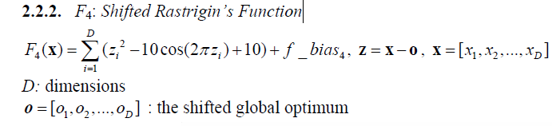
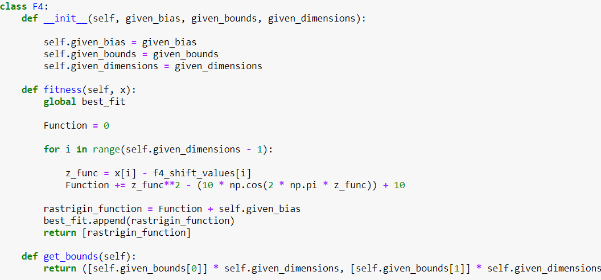
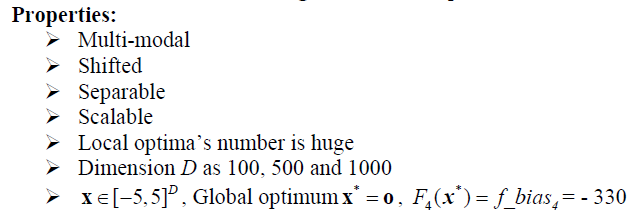
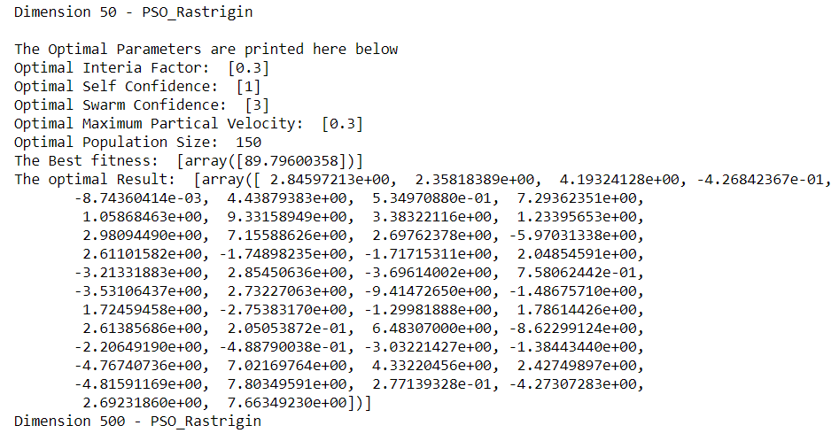
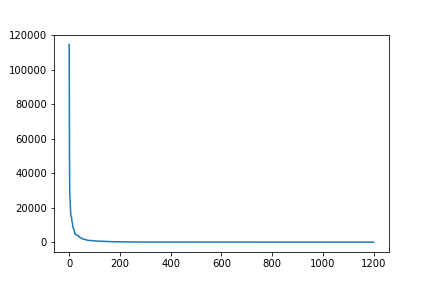
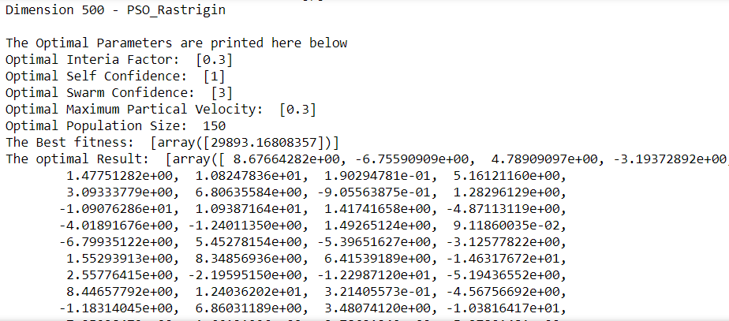
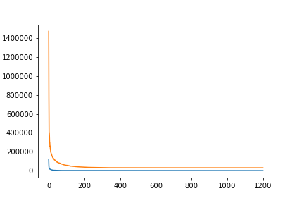

# F4 Shifted Rastrigin’s Function Optimization Using the 'Partical Swarm Optimization' Method
## Introduction and Setup
###### Figure 1 - Shifted Rosenbrock's Fucntion that will be Optimized

### The 3 functions of this class are the primary internal functions that PSO will use when running the 'Shifted Rastrigin' function. 
###### Figure 2 - Class definition

###### Figure 3 - Parameters

### The creation of the pso_optimizer and the running method is the same as the one thorooughly described in the Shifted Sphere ReadMe

## Optimal Result according to the function for Dimension 50
#### Optimal Interia Factor: 0.3
#### Optimal Self Confidence: 1 
#### Optimal Swarm Confidence: 3
#### Optimal Maximum Partical Velocity: 0.3
#### Optimal Population Size:  150
#### The Optimal Result: 
        2.84597213e+00,  2.35818389e+00,  4.19324128e+00, -4.26842367e-01,
       -8.74360414e-03,  4.43879383e+00,  5.34970880e-01,  7.29362351e+00,
        1.05868463e+00,  9.33158949e+00,  3.38322116e+00,  1.23395653e+00,
        2.98094490e+00,  7.15588626e+00,  2.69762378e+00, -5.97031338e+00,
        2.61101582e+00, -1.74898235e+00, -1.71715311e+00,  2.04854591e+00,
       -3.21331883e+00,  2.85450636e+00, -3.69614002e+00,  7.58062442e-01,
       -3.53106437e+00,  2.73227063e+00, -9.41472650e+00, -1.48675710e+00,
        1.72459458e+00, -2.75383170e+00, -1.29981888e+00,  1.78614426e+00,
        2.61385686e+00,  2.05053872e-01,  6.48307000e+00, -8.62299124e+00,
       -2.20649190e+00, -4.88790038e-01, -3.03221427e+00, -1.38443440e+00,
       -4.76740736e+00,  7.02169764e+00,  4.33220456e+00,  2.42749897e+00,
       -4.81591169e+00,  7.80349591e+00,  2.77139328e-01, -4.27307283e+00,
        2.69231860e+00,  7.66349230e+00
        
###### Figure 4 - Results for Dimension 50

###### Figure 5 - Convergence Curve, No. Iterations vs Fitness

### The Best fitness values is 89.79600358

## Optimal Result according to the function for Dimension 500
#### Optimal Interia Factor: 0.3
#### Optimal Self Confidence: 1
#### Optimal Swarm Confidence: 1
#### Optimal Maximum Partical Velocity: 0.5
#### Optimal Population Size:  100
#### The Optimal Result:
        8.67664282e+00, -6.75590909e+00,  4.78909097e+00, -3.19372892e+00,
        1.47751282e+00,  1.08247836e+01,  1.90294781e-01,  5.16121160e+00,
        3.09333779e+00,  6.80635584e+00, -9.05563875e-01,  1.28296129e+00,
       -1.09076286e+01,  1.09387164e+01,  1.41741658e+00, -4.87113119e+00,
       -4.01891676e+00, -1.24011350e+00,  1.49265124e+00,  9.11860035e-02,
       -6.79935122e+00,  5.45278154e+00, -5.39651627e+00, -3.12577822e+00,
        1.55293913e+00,  8.34856936e+00,  6.41539189e+00, -1.46317672e+01,
        2.55776415e+00, -2.19595150e+00, -1.22987120e+01, -5.19436552e+00,
        8.44657792e+00,  1.24036202e+01,  3.21405573e-01, -4.56756692e+00,
       -1.18314045e+00,  6.86031189e+00,  3.48074120e+00, -1.03816417e+01,
        7.25928479e+00, -1.66121996e+00, -2.78621249e+00,  5.27801481e+00,
       -8.34961617e-02,  2.90103368e+00, -7.80861389e-01, -1.07369101e+01,
        2.90000781e+00, -3.33303073e+00,  3.31135315e+00,  7.20719006e+00,
        1.01074111e+01, -8.92038391e+00,  1.41708242e+00,  3.11989243e+00,
        2.65109599e+00,  6.35997862e-01, -1.93475152e+01,  7.43750073e+00,
       -1.03683545e+00, -8.24379221e+00,  8.75327247e+00,  6.93623060e+00,
       -6.67933665e+00,  7.75538881e+00,  6.31784871e+00,  1.37059453e+01,
        3.88502108e-01, -4.46694071e+00,  1.59427294e+01,  4.11897720e-01,
        1.61604776e+01,  1.02260148e+00,  3.95058742e+00,  8.69710874e-01,
       -3.12840884e+00, -2.62208162e+00,  6.53768259e+00, -2.39569859e+00,
        9.09316055e-02,  9.03461720e+00,  2.44735219e+00,  1.18528929e+00,
        4.47201965e+00, -3.62463865e+00, -1.08141173e+01, -1.24453497e-01,
       -1.61007592e+01,  4.83998414e+00,  2.08540338e+00, -9.35956488e+00,
        5.69019735e+00,  1.25671314e+01, -2.55200608e+00, -5.64169549e+00,
       -6.11299983e+00,  5.23520949e+00, -4.01254263e+00, -2.68106649e+00,
        7.16122901e+00,  4.92340576e+00, -1.08775123e+01,  7.92461311e+00,
        4.84062896e+00,  1.36696457e+00,  1.27843178e+01, -7.92272927e+00,
        4.35243532e-01,  1.06546775e+00, -4.08913290e-01, -1.25708005e+01,
        1.06951603e+00, -3.01306440e+00,  7.98316172e+00, -2.48255812e+01,
        3.47846536e+00, -3.41789527e+00, -8.99494983e+00, -1.29543435e+01,
        2.63517041e-01,  2.81730765e+00,  1.23799422e+00,  4.19930917e+00,
       -5.87265478e+00, -3.68911029e+00,  3.50614455e+00,  3.60400475e+00,
        3.03448618e+00, -1.32650771e+01, -9.30705868e+00,  1.32101646e+00,
        3.15425179e+00, -8.74186190e+00,  6.59235064e+00,  2.88745429e+00,
        1.90479447e+01,  1.16158396e+01, -3.88897483e+00,  2.06995316e-01,
       -3.09684734e+00, -6.03283271e+00,  2.90569255e+00,  4.82808813e+00,
        3.25565386e+00,  1.52495369e+00, -1.10588505e+01,  7.04938323e+00,
        2.03152973e-01,  4.92825556e+00, -1.50760726e+00, -1.17948674e+01,
        3.03638701e+00,  3.60312917e+00,  7.51197152e+00, -2.44345902e+00,
        9.27980439e-01, -1.26560094e+00,  5.64861003e+00, -1.99013114e+00,
        8.13654570e+00, -1.34996614e+01, -4.15792867e+00,  5.60818572e+00,
        1.43300980e+00,  2.53409755e+00, -9.14622382e-01, -1.01728106e+00,
        3.40444024e+00,  8.15288764e+00, -4.25872651e-01, -4.42889467e+00,
       -8.51867684e+00,  6.59598650e+00, -2.37274136e+00,  7.20191061e-02,
        2.34845733e+00,  1.08384358e+01,  9.62871539e+00, -9.17948917e+00,
        8.31562831e+00,  3.22839588e+00, -1.85341325e+00,  2.19565089e+00,
       -7.18460372e+00, -2.45780054e+00,  7.69131780e+00, -4.07722205e-01,
        8.24847959e+00, -4.27522542e-02, -2.89135249e+00, -1.44545901e+00,
        6.42010287e+00,  9.79456602e-01,  3.23561832e+00,  2.68077001e+00,
       -1.40124552e+00,  8.16204718e+00,  3.75699486e+00,  3.65360787e+00,
        5.72195636e+00, -4.44035654e-01, -5.47188010e+00,  7.94205173e+00,
       -6.63870130e+00, -6.26511961e+00,  2.17047052e+00,  3.47294902e+00,
       -6.72668731e+00, -9.66277396e+00, -2.02502549e+01, -1.02467383e+00,
       -7.04327216e+00,  6.99656267e+00, -5.93598545e+00, -1.02263687e+00,
       -2.38966473e+00, -5.73420503e+00,  8.80970274e+00,  3.19052355e+00,
        2.70241712e+00, -4.13203945e+00,  2.27559343e+00,  5.14908008e-01,
        1.09528914e+00, -1.69651581e+00, -1.18804363e+01,  6.11263382e-02,
       -5.08393092e+00,  1.20380915e+01,  1.49007123e+00, -4.79687508e+00,
       -6.40810714e+00, -2.01453850e+01, -2.59645944e+00, -7.19715269e+00,
        2.58637542e-02, -1.18655850e+01, -1.17773827e+01,  4.08961042e-01,
        2.91364429e+00, -9.07803898e+00, -6.30180775e+00, -5.74032256e+00,
       -4.67992624e+00, -1.06739881e+01,  1.25742266e+00, -1.56170698e+01,
        8.42370997e+00, -9.89017107e+00,  1.67294677e+00,  3.57609919e-01,
       -2.02675139e+00, -1.39185205e+01, -6.80199112e+00, -9.12904913e+00,
       -6.39875067e+00,  2.24168324e+00, -2.45222601e+00, -1.52272678e+01,
        3.59790436e+00, -1.07502272e+00,  2.79050542e+00, -1.33195586e+00,
       -7.26734005e+00,  4.81315781e+00, -4.46464034e+00, -5.04824877e+00,
        1.38280979e+00,  8.22564718e+00, -2.92120758e+00, -1.50890972e+00,
       -6.93326630e+00, -1.41234241e+01, -3.01888544e+00,  8.19885534e+00,
        4.82159767e+00,  4.27774457e+00, -4.65570127e+00,  7.61221882e-01,
       -1.27481234e+01,  5.50842750e+00,  3.41808662e+00, -7.73521904e+00,
        6.76518471e+00, -6.29686838e+00, -9.23628349e+00,  9.04106786e+00,
        2.24163524e+00, -6.92636545e+00, -9.93432694e+00,  1.22732555e+00,
        7.96932619e+00, -2.69138345e+00, -1.54029187e+01,  1.34920873e+01,
       -5.42858945e+00,  7.10141927e+00,  4.41915695e+00, -6.59304754e-01,
        3.77986911e+00,  2.97753231e+00, -5.12021175e+00,  9.32331906e-01,
       -3.45763668e+00, -9.58266057e+00,  2.56712379e+00,  4.58133052e-01,
       -4.28073622e+00,  1.14999415e+01,  3.80518320e+00, -6.97954232e+00,
       -1.08395288e+01,  2.80066214e+00, -4.19870457e+00,  3.35757156e+00,
        2.07242079e+00, -5.35233139e+00, -9.38876500e+00, -2.25244566e+00,
       -6.09643846e+00,  4.30874271e+00,  1.47595739e+01, -7.79457661e-01,
        7.88128198e-01,  3.88385668e+00,  5.62044940e+00,  9.19676967e-01,
       -4.10924044e+00, -1.24522889e+01, -3.17559427e+00, -3.44973634e+00,
        8.36931157e+00, -1.18510963e+01,  1.43812932e+00, -2.20327636e+00,
        1.70188816e+01,  6.60584324e+00, -1.97722196e+00,  7.48918910e+00,
        2.23422138e+00, -1.69441088e+00,  7.63762358e+00,  3.48736694e+00,
        1.59526468e+01, -8.14039256e+00,  1.85140325e+00, -1.14895898e+01,
       -8.14154857e+00,  6.98088394e+00,  3.31161396e+00, -5.21099529e+00,
       -5.32740655e+00,  6.32193268e+00,  1.00950140e+01,  3.51862680e+00,
       -1.67184117e+01, -4.76099016e+00, -3.23385448e+00,  1.35118166e-01,
        8.92942535e+00, -4.50107984e+00,  3.35682173e+00, -4.49212406e+00,
        3.75560843e+00, -6.53496321e+00,  1.53289072e+00, -4.92810169e+00,
        6.80443116e+00, -1.29119499e+00, -6.28707457e-01,  3.98947298e+00,
       -8.42650232e+00, -3.89137910e+00, -5.39064530e-01, -4.62129404e+00,
        1.46441150e+00,  1.76351899e+00, -1.27450301e+01, -8.41186167e-01,
       -7.58262161e+00,  5.50666097e+00,  7.75479588e-01,  4.19554383e+00,
       -4.24099087e+00,  5.44034821e+00, -1.76717991e+00,  4.95663640e-02,
       -1.23296783e+01,  1.20057433e+01,  1.20708882e+00,  5.41914902e+00,
       -3.93678552e+00,  3.61971673e+00,  7.55167397e-01,  3.81829840e+00,
        4.29420248e+00, -6.19252061e+00, -1.58934613e+00, -4.66017062e+00,
       -1.80199630e+00,  3.19869745e+00, -9.13867039e+00, -1.79426963e+01,
       -4.51886025e-02,  3.52616879e+00,  4.03065565e+00,  1.96979932e+01,
       -4.83160240e-01,  5.75357866e+00,  5.94471457e+00,  5.44674574e+00,
       -6.08890395e+00,  1.16246515e+01,  1.12036496e+01,  1.31160447e+01,
        2.07926978e+00, -2.99613131e+00, -1.35441201e+00,  5.44111144e+00,
       -3.17191076e+00, -4.41034403e-01,  1.65379032e+00, -9.64605651e-01,
       -1.83985143e+01, -2.76379183e+00, -2.04719754e+01,  9.19871408e+00,
       -3.59030995e+00,  4.82156748e+00,  5.73657612e+00, -2.74004353e+00,
       -6.55330362e+00, -1.31868042e+00, -9.66930108e+00,  6.71894862e+00,
       -1.75460009e+00,  3.97477641e+00, -2.11936970e+00, -1.22147171e+00,
        9.16556176e-01,  5.36500971e-01, -9.54080879e+00,  2.34327998e+00,
       -1.36585594e+01,  6.39515489e+00, -4.99292367e+00, -1.09263018e+01,
       -3.39433638e+00, -1.08194939e+01,  1.13499418e+01, -7.46323960e+00,
       -5.15705459e+00,  3.00286958e-01, -3.38725206e+00, -6.87460751e+00,
       -7.68503080e+00, -6.02450163e+00, -7.99832129e+00, -4.85184511e+00,
       -8.66760217e+00, -9.25903618e+00,  1.17970227e+01,  1.89488857e+00,
        1.74604809e+00, -5.07954334e+00,  5.25279289e+00, -1.67399891e-01,
       -4.85056068e+00, -4.20662735e+00,  2.88826789e+00, -2.07757579e+01,
       -1.98418988e+01,  8.68638549e+00, -2.58615414e+00, -1.44595742e+00,
       -1.77122433e+00, -1.00594852e+01, -5.34468956e+00,  1.15198056e+00,
        3.66115582e-01,  1.14388327e+01,  1.39362001e+00, -7.31606993e+00,
        3.51998154e+00,  3.98111604e+00, -1.48981625e+01,  1.01522110e+01,
       -7.23104211e+00,  1.51422452e+00, -5.75626962e+00, -4.33037701e+00,
        5.37935447e+00,  7.83526965e-01, -2.63513552e+01, -6.01971377e+00,
       -1.61992492e+01, -1.07568850e+00,  2.77212894e+00, -3.53049130e+00 
       
###### Figure 6 - Results for Dimension 500

###### Figure 7 - Convergence Curve, No. Iterations vs Fitness

### The Best fitness values is 2989

