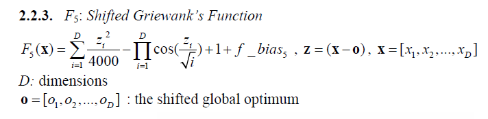
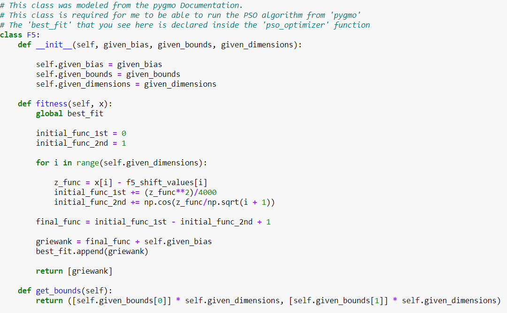
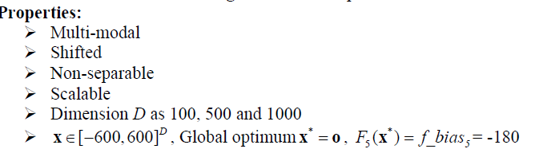
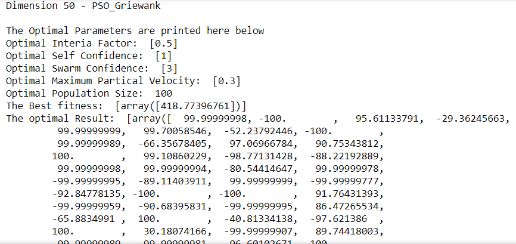
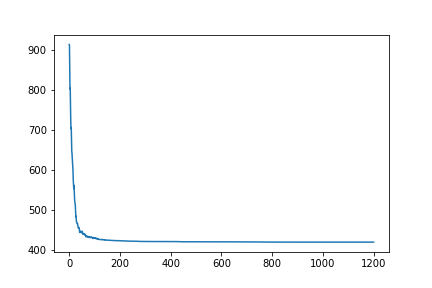
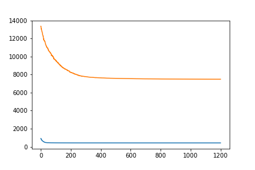

# F5 Shifted Griewanks Function Optimization Using the 'Partical Swarm Optimization' Method
## Introduction and Setup
###### Figure 1 - Shifted Griewank's Fucntion that will be Optimized

### The 3 functions of this class are the primary internal functions that PSO will use when running the 'Shifted Rosenbrock' function. 
###### Figure 2 - Class definition

###### Figure 3 - Parameters

### The creation of the pso_optimizer and the running method is the same as the one thorooughly described in the Shifted Sphere ReadMe

## Optimal Result according to the function for Dimension 50
#### Optimal Interia Factor: 0.5
#### Optimal Self Confidence: 1 
#### Optimal Swarm Confidence: 3
#### Optimal Maximum Partical Velocity: 0.3
#### Optimal Population Size:  100
#### The Optimal Result: 
        99.99999998, -100.        ,   95.61133791,  -29.36245663,
         99.99999999,   99.70058546,  -52.23792446, -100.        ,
         99.99999989,  -66.35678405,   97.06966784,   90.75343812,
        100.        ,   99.10860229,  -98.77131428,  -88.22192889,
         99.99999998,   99.99999994,  -80.54414647,   99.99999978,
        -99.99999995,  -89.11403911,   99.99999999,  -99.99999777,
        -92.84778135, -100.        , -100.        ,   91.76431393,
        -99.99999959,  -90.68395831,  -99.99999995,   86.47265534,
        -65.8834991 ,  100.        ,  -40.81334138,  -97.621386  ,
        100.        ,   30.18074166,  -99.99999907,   89.74418003,
         99.99999989,  -99.99999981,   96.60102671, -100.        ,
         99.99999996,    3.37254238,   83.27770611,  -85.32941214,
        -99.99999977,  -99.99999962
        
###### Figure 4 - Results for Dimension 50

###### Figure 5 - Convergence Curve, No. Iterations vs Fitness

### The Best fitness values is 418.77396761

## Optimal Result according to the function for Dimension 500
#### Optimal Interia Factor: 0.5
#### Optimal Self Confidence: 1
#### Optimal Swarm Confidence: 3
#### Optimal Maximum Partical Velocity: 0.3
#### Optimal Population Size:  100
#### The Optimal Result:
        99.99986127,  -99.99727735,   95.40751122,  -54.24816969,
        100.        ,   99.50102585,  -68.23604274,  -99.72062675,
         99.9474933 ,  -66.29420242,   97.35914773,   99.99280372,
         99.94172093,   99.55462506,  -99.45229094,  -87.78872735,
         99.98867382,   99.99728899,  -98.87326755,   99.95156305,
        -99.3573916 ,  -99.98993893,  100.        ,  -99.99897097,
        -99.99830221, -100.        ,  -98.80533376,   92.69316431,
        -99.95851569,  -99.99765611,  -99.66774673,   99.99996924,
        -65.07007458,   99.73972424,  -39.45424324,  -99.87829026,
         99.77766981,   67.71437244,  -99.99916918,   89.07996217,
         94.22168364,  -98.97732587,   99.2385551 , -100.        ,
         99.98238056,   46.64569758,   99.94164368,  -85.49968286,
        -99.91348065,  -99.99609145,  -99.7724724 ,   86.55954403,
        -99.3790139 ,   90.76774068,  -99.99999913,   99.82849321,
        -99.9964199 ,   99.66855969,   98.81406317,   99.86946606,
        -50.79741759,   99.94985092,   99.46588644,   77.12897922,
         97.18804234,   93.22174436,  -92.36193316,  -99.86623465,
        -99.33926585,   91.77780424,   99.14194262,  -99.93737514,
         99.88929655,   99.9875571 ,  -97.93767236,   88.588785  ,
         57.95463418,  -64.86911294,   99.99198372,   99.93696716,
         99.99360337,  100.        ,   82.0529805 ,   99.99927168,
       -100.        ,   99.99602475,  -99.91416243,  -99.95451093,
         99.96907441,   99.88423146,  -99.99854312,  -99.97652089,
         99.90168265,  -99.49268482,  -99.42872079,   81.9917739 ,
        -75.25278433,  -34.94469327,  -99.98617179,   99.96753181,
         99.5617405 ,  -94.9403177 ,   18.72573168,  -99.98053838,
        -86.9561093 ,  -99.67554094,   95.15076759,   98.51908635,
         37.34508206,   99.73805698,  -99.90643644,  -99.88644994,
         99.914104  ,   94.67029372,  -45.52493677,   85.49316563,
         99.95172405,  -99.30027847,   58.42187334,  -99.54582708,
       -100.        ,  -99.99999164,   99.99997714,  -99.31273334,
         99.99504212,   99.99889874,   99.92994346,   98.9623239 ,
        -75.54013941,    9.30005967,  -99.35368353,   99.74765896,
        -99.90008417,   99.79403317,   99.81143587,  -99.16194828,
         99.55084186,  -99.9921725 ,  -99.86975865,   99.98803453,
         77.4882347 ,  -99.98489276,   99.86765263,   84.30608196,
        -99.50520193,  -99.82347349,   99.93719519,   82.90860236,
        -81.12740458,   93.12508153,  -54.92150475,  -99.88261541,
        -99.99944391,  -99.99965383,  -99.99929805,  -99.97166335,
         99.99999172,  -99.99884974,  -99.97111183,   79.43119365,
         54.4009318 ,  -99.91726645,  -99.99953605,  -99.99766619,
         99.50181489,  -99.99594464,  -82.66626266,   81.98716215,
         99.99680949,   85.51818252,  -99.99545694,  -55.54985397,
        -70.88472929,  -99.99968129,  -99.96164895,   99.91450291,
         99.99722649,   99.20770331,  -25.58040446,   65.64924354,
        -99.99966951,  -59.14146909,   98.38722857,   99.39771814,
        -99.98149474,  -99.88375585,   99.99980858,  -99.9623165 ,
         99.99779513,   99.9809938 ,  -99.99997016,  -99.98360588,
       -100.        ,  -98.52553237,   86.08257998,  -99.99105795,
         99.91610855,  -99.94508337,  -99.99574527,   99.99078461,
        -72.15744691,  -99.59143937,  -99.94880411,  -81.30218834,
        -99.80418425,   99.87556583,  -99.97052552,  -99.99998874,
        -53.8998828 ,   99.95193334,   99.99815751,  -96.81106492,
        -99.88180601,   97.16203921,  -99.96960161,   93.4121015 ,
         99.92486923,   99.77564271,   99.46580451,  -99.99998704,
        -99.91157218,   99.99848565,  -82.96883691,   99.37374111,
         99.98510606,   99.68754571,  -99.95570535,  -99.94260868,
        -99.99740143,  -99.88758955,  -91.41832744,   98.77417619,
        -14.03919183,   99.69365093,  -45.17785033,  -56.35853727,
        -59.03307667,  -99.99976781,   99.74440066,  -99.99144168,
        -98.72759733,  -99.81617971,   99.87874078,  100.        ,
         99.98843496,   58.07234984,  -99.84928212,  -99.99967659,
         99.95175678,   99.72579507,  -66.02148583,  -99.97682679,
       -100.        ,  100.        ,   99.92529971,   99.63364607,
         99.8760459 ,  -79.25939544,   99.68698419,   99.99984384,
        -99.95689425,   99.99754015,   93.1177885 ,   68.07773208,
        -99.04616564,   56.70102056,   99.95614573,  -98.86421733,
         99.45377348,  -99.98776702,   60.78882164,   99.67829738,
        -99.99530896,  -99.99999329,   99.99556784,  100.        ,
        -60.19973967,  -94.53193316,   99.80396317,   78.29852379,
         99.9978042 ,   13.45820536,   99.99986749,  -18.01641205,
        -99.99989938,   99.98658365,   99.99998389,   99.65507322,
         99.94511135,  -18.67959491,  -99.99999549,   96.04905023,
        -85.66111942,  -99.79471345,   82.13068471,   99.86056228,
         98.76299398,   99.99999959,   99.97435119,  -99.9130711 ,
        -99.40022002,   58.60914033,  -90.55429176,   99.93303736,
        -99.83014228,   76.93127876,   99.99999969,   99.99997794,
         99.94742213,   99.81318921,  -97.5127274 ,   99.99650126,
         99.79059442,  -99.99996199,   99.9994767 ,   99.98313699,
         99.99264659,  -94.90317949,   99.86249083,   14.93571848,
         99.90843643,  -85.38380589,  100.        ,  -99.8932189 ,
         66.04818686,  -99.91613647,   99.75374075,  -99.06272648,
         99.86638831,  -99.97442246,  -84.28861043,   -3.703884  ,
        -96.28454896,   71.65936269,   99.59905334,  -99.80507877,
         99.9947336 ,   99.84230418,   99.99883044,   99.93829932,
         99.52914816,  -99.77357879,  -99.99993602,   99.99432758,
         43.19680709,  -99.83926617,  -99.99989699,  -99.7100592 ,
        -97.23173819,  -34.21217756,   99.97691733,   97.30219714,
        -99.94200058,  -25.13601099,   99.90144109,  -99.9308991 ,
         99.99849584,   99.99829922,   97.27386106,  -99.66264558,
         99.99465375,   99.99054728,   96.45087844,  -99.99993276,
        -97.94284957,  -99.99932759,  -99.41453486,   99.99999909,
         99.99777867,  -58.68800255,   99.91846628,  -99.9970183 ,
         99.9137833 ,   99.45758484,  -66.93723506,   98.71575483,
         99.99899638,   99.99999958,  -93.10794683,  -81.39960973,
        -99.99951774,  -11.19447088,  -99.87790971,  -49.00175936,
         99.8285802 ,  -99.98907649,  -99.96843639,  100.        ,
        -99.77317376,   99.99778765,  -99.99996927,   95.68351912,
         -0.39410022,  -46.93194124,   42.15502493,   99.95812704,
        -99.99221574,  -99.99999993,  -99.99999828,  -99.99334619,
        -99.47131464,  -99.99978205,    1.42083801,   99.99989886,
        -99.69213634, -100.        ,  -68.74957285,  -43.22147369,
       -100.        ,   99.99692241,   99.82830008,  -99.99999714,
       -100.        ,   99.99754238,   98.8560253 ,   99.01232263,
        -30.58017243,   99.45935243,  -56.67498541,   98.43121997,
         99.95598327,  -99.87839739,  -99.99940378,   22.80420125,
         99.97628488,   95.57281634,  -44.07391439,  -62.8125748 ,
        -99.98949298,  -59.82822428,  -97.11884712,  -99.99405644,
         99.99848952,   99.89177852,   99.99790447,   71.63764792,
        -99.994331  ,   99.97039391,   99.99524975,   99.95331576,
        -99.93946318,   99.4564351 ,   22.20448766,   99.99269694,
         98.93626444,  -99.92861297,  -60.80432012,  -99.99949043,
        100.        ,  -97.76613932,  -99.65679881,   99.78726594,
         98.03943211,  -99.99706712, -100.        ,   99.99999996,
        -99.80742308,   99.97959053,   99.14327497,   99.97110681,
        -99.50227049,  -57.3332428 ,  -99.99563569,   99.99579775,
         72.3553222 ,  -99.88935093,  -99.86320061,   99.99744874,
       -100.        , -100.        ,  -99.64169154,  -99.50686658,
         97.35610329,  -99.69653602,   32.89736924,  -99.96949641,
         99.08440118,  -91.58255207,   99.93759583,  -99.196019  ,
         99.93571406,   99.96109221,  -99.99429854,   99.88240092,
        -99.9992182 ,  -99.99999925,  -99.99707517,   99.99859517,
        -99.99992787,  -97.33227725,   99.99917698,  -99.99977426,
         -5.27443266,  -99.21203259,   98.95207322,   99.99991094,
         99.98880304,   99.85244455,  -99.98189722,  -99.96315349
        
###### Figure 6 - Results for Dimension 500

###### Figure 7 - Convergence Curve, No. Iterations vs Fitness

### The Best fitness values is 7483.03654022

