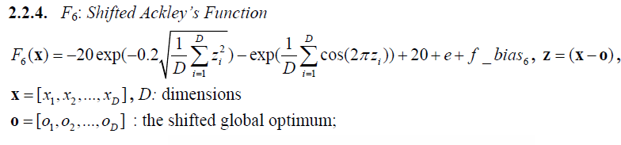
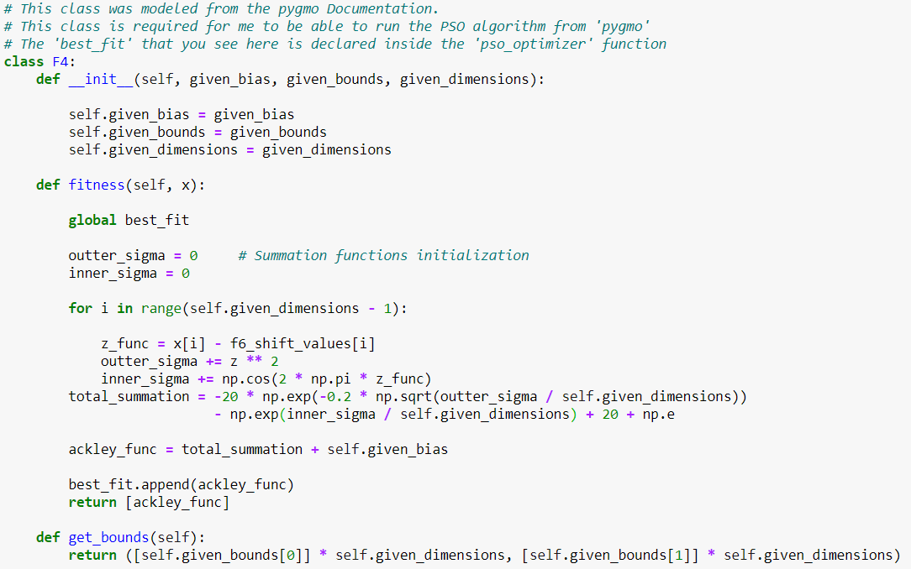
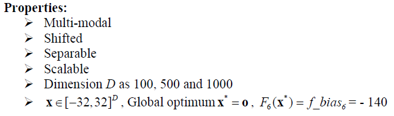
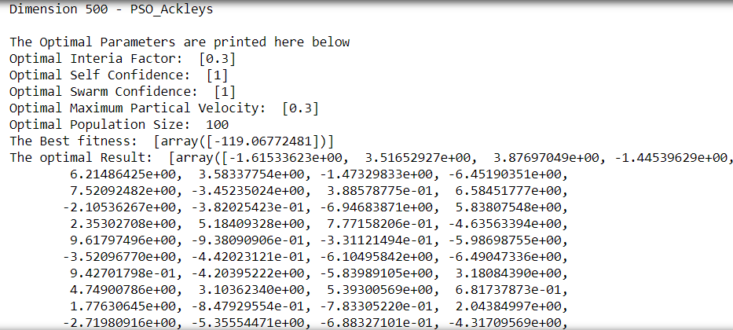
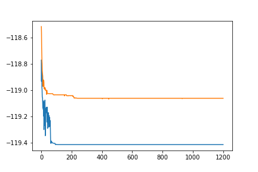

# F5 Shifted Ackley's Function Optimization Using the 'Partical Swarm Optimization' Method
## Introduction and Setup
###### Figure 1 - Shifted Ackley's Fucntion that will be Optimized

### The 3 functions of this class are the primary internal functions that PSO will use when running the 'Shifted Ackley' function. 
###### Figure 2 - Class definition

###### Figure 3 - Parameters

### The creation of the pso_optimizer and the running method is the same as the one thorooughly described in the Shifted Sphere ReadMe

## Optimal Result according to the function for Dimension 50
#### Optimal Interia Factor: 0.3
#### Optimal Self Confidence: 1 
#### Optimal Swarm Confidence: 1
#### Optimal Maximum Partical Velocity: 0.3
#### Optimal Population Size:  100
#### The Optimal Result: 
        -4.46236962e+00, -7.04564506e+00, -1.38696979e+00,  8.14299211e+00,
       -1.06251823e+01, -2.68516157e+00,  1.30132112e+00, -1.10009921e+01,
        9.11877188e+00,  1.75871474e+00,  1.90222578e+01, -7.19101575e+00,
        1.61852109e+01, -2.17995138e+00, -4.92075706e+00,  1.43425006e+01,
       -3.42152450e+00,  1.94113035e+01, -1.22863697e+01,  1.58021077e+01,
        1.64561225e+01, -9.68221516e+00,  8.94189406e+00, -6.59914530e+00,
        2.14143986e-01, -1.36312079e+01, -2.97766685e+00, -1.15079242e+01,
        5.39636716e-01, -2.93185307e+00, -3.43348366e-03,  3.75583611e+00,
        5.37405302e+00,  7.84637137e+00,  4.59059156e+00, -6.75664095e+00,
        3.85001735e+00, -3.07681927e+00, -8.95502240e+00,  1.36837968e+01,
        5.08076422e-01, -9.79428907e+00, -3.78157075e+00, -3.38009638e+00,
        3.75391369e+00,  8.30624344e+00, -5.46850842e+00,  4.64270485e+00,
        1.42332233e+00, -1.13526302e+01
        
###### Figure 4 - Results for Dimension 50

###### Figure 5 - Convergence Curve, No. Iterations vs Fitness

### The Best fitness values is -119.41250266

## Optimal Result according to the function for Dimension 500
#### Optimal Interia Factor: 0.3
#### Optimal Self Confidence: 1
#### Optimal Swarm Confidence: 1
#### Optimal Maximum Partical Velocity: 0.3
#### Optimal Population Size:  100
#### The Optimal Result:
        -1.61533623e+00,  3.51652927e+00,  3.87697049e+00, -1.44539629e+00,
        6.21486425e+00,  3.58337754e+00, -1.47329833e+00, -6.45190351e+00,
        7.52092482e+00, -3.45235024e+00,  3.88578775e-01,  6.58451777e+00,
       -2.10536267e+00, -3.82025423e-01, -6.94683871e+00,  5.83807548e+00,
        2.35302708e+00,  5.18409328e+00,  7.77158206e-01, -4.63563394e+00,
        9.61797496e+00, -9.38090906e-01, -3.31121494e-01, -5.98698755e+00,
       -3.52096770e+00, -4.42023121e-01, -6.10495842e+00, -6.49047336e+00,
        9.42701798e-01, -4.20395222e+00, -5.83989105e+00,  3.18084390e+00,
        4.74900786e+00,  3.10362340e+00,  5.39300569e+00,  6.81737873e-01,
        1.77630645e+00, -8.47929554e-01, -7.83305220e-01,  2.04384997e+00,
       -2.71980916e+00, -5.35554471e+00, -6.88327101e-01, -4.31709569e+00,
        4.07690397e-01,  5.00718308e+00,  1.80573836e+00, -4.00901374e+00,
       -3.74458133e+00,  1.70549419e+00, -8.68484511e-01,  7.35719822e-01,
       -4.27747235e+00,  5.00474794e+00,  4.06632882e+00, -5.58425214e+00,
       -8.39744167e+00, -3.36659205e+00,  7.65641817e-01, -3.06845380e+00,
       -4.57219551e+00, -7.15522464e+00, -3.56997456e+00, -1.15908406e+00,
        2.46974198e+00,  1.42171598e+00, -1.15733384e+01, -9.87335916e-01,
       -1.01580460e+00, -5.09881517e+00, -3.83457197e+00,  4.51042512e+00,
        3.88731062e+00,  5.99599347e+00,  3.13200132e+00,  4.44485836e+00,
        3.03315179e+00,  1.37201100e+00,  3.41207708e+00,  2.84528577e+00,
       -4.63373540e-01, -9.03174914e-01,  4.57317633e+00,  5.30585941e+00,
        5.85462492e+00, -4.21941577e+00, -6.83875082e+00, -4.41864756e-01,
        4.91312013e+00,  6.86547323e+00,  2.65300423e+00,  3.92452667e+00,
        8.03687506e+00,  5.46384514e+00,  1.17588047e+00,  4.01770419e+00,
       -7.83625377e-01,  9.50174209e+00,  6.37327496e+00,  7.72453537e+00,
       -1.12246906e+01,  9.56665355e-01, -2.29713892e+00,  1.41615848e-01,
       -6.24816503e+00, -8.20515032e+00,  1.80640052e+00, -6.97169730e+00,
       -2.07903571e+00,  2.33387035e+00,  4.35079457e-01, -4.17658302e+00,
        5.21757472e+00,  4.00390599e+00,  2.41708930e+00,  3.76237163e+00,
       -2.78880627e+00, -6.36564848e+00, -5.48740189e-01,  9.85079813e-01,
        5.30144122e+00,  1.32873364e+00,  1.44665119e+01, -5.06271057e+00,
       -6.19438815e+00,  5.52586934e+00,  1.11673900e+01, -6.88379344e+00,
        8.18014309e+00,  2.13282363e-01, -2.76092556e+00,  3.21570636e-01,
       -1.10402009e+00,  5.29397730e+00,  2.31838409e+00,  5.69504953e+00,
       -3.53459979e+00, -2.18913597e+00,  4.63818300e+00, -1.06354726e+01,
       -7.70869153e-01, -2.56726514e+00,  1.03363127e+01,  1.66857547e+00,
       -2.43143051e+00,  1.77706397e-01,  1.51175770e+00,  8.49569897e+00,
       -9.76209929e+00,  6.05030806e+00,  3.65318352e+00, -1.01675848e-01,
        1.52486011e-01,  1.54268027e+00, -3.27913848e+00,  2.31530177e+00,
        7.38897653e-01,  4.37787784e+00,  4.20256225e+00,  6.20939931e+00,
       -4.54750538e+00, -2.27963628e+00,  2.42035379e+00, -6.04359960e+00,
       -1.89270935e+00, -3.24371585e+00,  3.70121788e-01, -4.61175888e-01,
        1.12994347e+00, -1.66007241e+00, -5.82659297e+00,  2.80553969e-02,
       -9.12548304e-01,  6.27460183e+00, -5.48851658e+00, -1.83909450e+00,
       -1.25214308e+01,  2.41675643e+00,  4.59774225e+00,  1.23724069e-01,
       -3.49650069e+00, -4.21292464e+00, -3.13426547e+00,  7.80943009e+00,
        1.55739210e+00,  1.67692192e+00,  2.85078135e+00,  3.09628246e+00,
        1.00950556e+01,  1.17183090e+00, -6.17887779e+00, -2.57629109e+00,
        9.90341064e+00, -1.24193496e-01,  1.93729200e+00,  7.01494538e+00,
        1.15896329e+01,  1.60129440e+00,  3.34223937e+00, -5.01974274e+00,
        8.63842959e+00, -1.39218570e+00,  9.28175684e-01, -2.60817148e+00,
       -2.21380448e+00,  1.70543373e+00, -2.44786448e+00,  1.07401096e+00,
        2.47166312e-01, -2.72699394e+00,  6.48994075e+00,  4.43481302e+00,
       -3.99160557e+00, -3.33750685e+00, -1.70768021e+00,  7.82685893e+00,
       -7.99412390e-01,  3.74092436e+00,  3.69282889e+00,  9.32952403e+00,
       -9.50148453e+00, -2.56914418e+00,  3.80222094e+00,  4.98501839e+00,
        2.34909082e+00,  3.72821284e-01, -3.15540596e+00, -4.10768593e-01,
        3.41195561e+00,  2.70496974e+00, -6.30503670e+00, -7.49855265e+00,
        3.22371063e-01, -3.40769118e+00, -1.05810251e+01,  3.62270730e+00,
       -2.78202341e+00, -1.21348543e+01,  3.56954118e+00, -8.97899917e-01,
       -4.77260693e-01, -9.86734916e-01,  1.79540556e+00, -1.22660103e+00,
        4.30483847e+00, -8.22991078e+00,  1.42919339e+00,  3.16241543e+00,
       -1.52111344e+00,  1.05058236e-01,  5.04543583e+00, -1.45165725e+01,
        4.42082959e+00, -1.90979167e+00,  5.58308388e+00,  4.24451624e+00,
       -3.73246928e+00,  3.80929238e+00,  5.95806905e+00, -1.91195068e+00,
       -5.36518555e+00,  2.73571053e-01,  3.41609082e+00,  1.03767751e+01,
        3.98797095e+00,  1.29846576e+00, -8.23552531e+00,  1.15599511e+00,
        3.58210648e+00,  2.20094426e+00,  1.57111023e+00,  2.27592797e+00,
       -7.28823385e+00,  2.04144343e+00,  1.59461609e+00, -3.61758708e+00,
       -8.93588673e-01, -7.81232630e+00, -1.89844188e+00, -3.44726756e+00,
       -6.69447362e+00,  7.80708800e+00, -5.48460302e+00,  6.23776975e-01,
        4.23952269e+00, -3.56947510e+00, -6.24284135e+00, -8.32910034e-01,
       -7.92179665e+00, -3.04708620e+00, -1.89560893e+00, -9.40158479e+00,
       -8.62517439e-01, -7.91846291e+00,  1.33193156e+00,  4.15525143e-01,
        3.05012021e+00, -3.56477753e-01,  4.40636929e+00,  1.70301542e+00,
       -4.86745441e+00, -9.60711990e+00, -2.70170648e-01,  2.61003113e-01,
       -6.83863129e-01,  2.48828037e+00,  3.13254635e+00, -9.02354465e-01,
       -3.05806011e+00,  5.14643098e+00,  4.07441524e-01,  8.90469629e-01,
       -6.00771865e+00, -3.74014414e+00,  2.71437142e+00, -4.77582376e+00,
        4.43130164e+00,  2.20024634e+00, -3.40373238e+00, -4.94935937e+00,
        2.07182076e+00,  3.86514093e+00, -3.68823417e+00,  8.31211411e-02,
       -9.08754933e+00, -1.06534110e+00,  4.65202900e-01, -8.16228117e-01,
        5.09899320e+00, -1.96059538e+00,  4.15298114e+00,  1.46012571e+00,
       -1.49247709e-01,  2.09279243e+00, -5.00713096e+00, -1.90421035e-01,
        2.94853306e+00,  6.42830193e+00,  4.30872450e+00,  2.80535699e+00,
       -3.64000188e+00, -1.00833550e+00, -6.22183021e+00,  4.55782019e+00,
        9.67877872e+00,  4.51336788e+00,  4.47537227e+00, -2.49995665e+00,
       -6.66460064e-01,  1.05404263e+00, -1.38287523e+00, -8.59691832e+00,
       -6.13166880e+00, -2.26779171e+00,  3.66333104e+00, -6.14225191e+00,
        2.96117618e+00,  3.59880038e-01, -9.87775437e-03, -4.31275495e+00,
        6.22975260e+00,  8.38426130e+00,  8.36619894e+00, -1.57736514e+00,
        4.53228260e+00, -1.87777234e+00,  1.91247809e+00, -4.15263224e+00,
       -1.54056039e+00,  6.04492174e+00, -7.09241969e-01, -1.07092863e+01,
        5.31031094e+00,  5.94615942e+00, -3.13887463e-01,  1.09972254e+01,
        1.24496580e+00,  8.72404272e+00, -4.89585123e+00,  2.15664061e+00,
        4.26559972e+00, -1.26465339e+00,  9.61022634e+00,  5.19839417e+00,
        5.85214144e-01,  4.00334433e+00, -2.29208337e+00,  8.78556534e+00,
       -7.54121868e+00, -3.14381918e+00,  6.65347786e+00, -1.36290521e+00,
       -1.69720097e+00,  4.25187221e+00,  3.50506524e-01, -6.56166703e+00,
        3.27112461e+00, -2.27300687e+00,  3.30906039e+00,  3.54113189e+00,
       -2.76873119e+00, -2.40462712e+00, -2.92345022e+00, -6.88655801e+00,
        2.98374332e+00,  1.85172658e+00,  3.18260621e+00,  6.80791109e+00,
        1.59445856e+00, -4.38895332e+00, -2.33482118e+00, -2.74191182e+00,
        2.77519643e+00,  5.10761638e-01, -3.74823232e+00,  1.94982564e+00,
       -3.85227155e-01,  1.91559176e+00,  5.07199932e+00, -1.93936509e+00,
       -1.28098345e+00,  5.49703134e+00,  6.84080439e+00,  3.28740731e+00,
       -4.16120519e+00, -2.01536372e+00,  6.62681492e+00, -1.03058773e+01,
        2.26369942e+00,  2.62516602e+00, -1.38633138e+01, -9.11890821e+00,
        2.03219408e+00,  2.21881349e+00, -5.91562867e+00, -4.94428028e-01,
       -1.65565158e+00, -8.86852396e+00, -8.32168354e-03,  3.74862513e+00,
        9.95755292e-01,  4.81688208e+00, -2.13740134e+00, -2.48330968e+00,
       -5.85056077e+00,  2.46523854e+00, -1.24616922e+01, -3.21200725e+00,
        1.87233320e+00, -7.39175184e+00, -6.27824634e+00,  2.72388595e-01,
        3.66953795e-01,  2.92423710e+00, -4.36667395e+00,  4.28907876e-01,
       -9.07584750e-01,  5.02233252e-01,  2.12096653e+00,  8.48877184e-01,
       -2.26268827e+00,  7.32226866e+00,  1.10609594e+01,  1.19606462e+01,
       -1.34874007e+00, -7.52374160e+00,  2.14320204e+00,  1.72791737e+00,
        1.15117297e-01, -4.72562545e+00,  6.28591921e-01,  2.58306629e-01,
        3.91381285e+00, -5.79341879e+00,  4.21880172e+00,  6.18068356e+00,
        6.69572002e+00,  6.35917643e+00, -1.39127673e+00,  3.09884224e+00,
        4.78768161e+00, -7.89816582e+00, -4.14000432e+00, -1.95855272e+00,
       -2.55461470e+00, -7.97559558e+00,  7.07948651e+00,  3.27525152e+00,
       -2.01233916e+00, -3.79830361e-01, -1.79668098e+00, -3.49180808e+00,
       -2.09842932e+00, -5.63474461e+00, -7.34439520e+00, -3.70830822e+00,
        2.50371055e+00,  3.52696169e+00,  5.21368467e+00,  3.03538058e+00
        
###### Figure 6 - Results for Dimension 500

###### Figure 7 - Convergence Curve, No. Iterations vs Fitness

### The Best fitness values is -119.06772481

