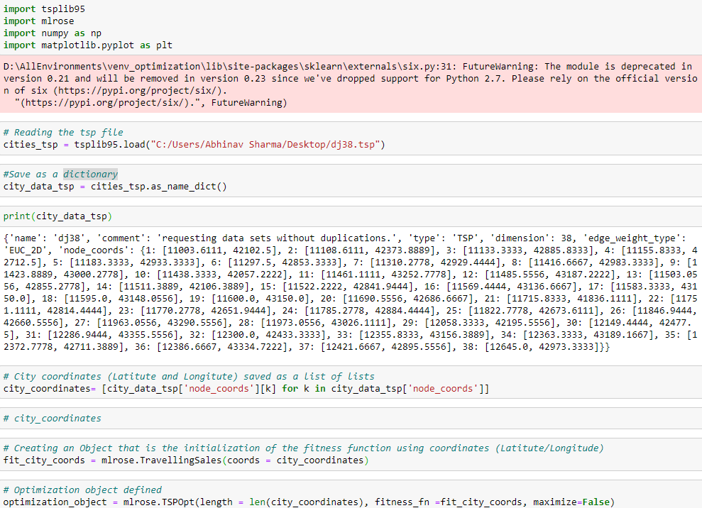
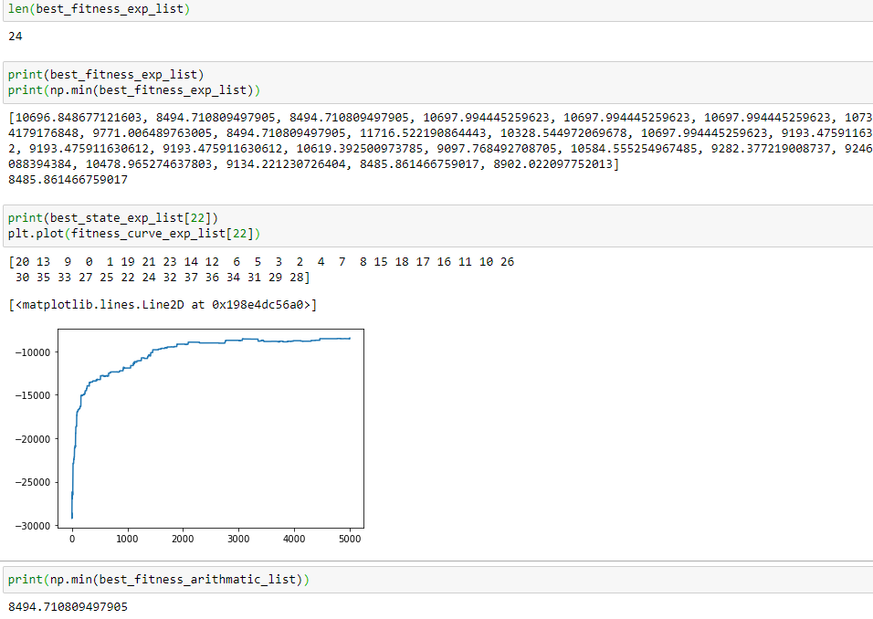

# 1) TSP Djibouti 

## Problem Statement: What is the fastest way to move accross all 38 cities in Djibouti ?

## Simulated Annealing and the Genetic algorithm are compared to see which gives the best fitness 

#####    Two types of cooling methods were used and compared (Exponential Decay and Arithmatic Decay) for simulated annealing. The best 
#####    fitness value yielded by the the two cooling methods (for simulated annealing) will be chosen and compared with the 
#####    best fitness value from the genetic algorithm. 

#####    I used jupyter notebook to run my code. 
 
 
 ### Step 1 - Importing of Relavant packages. MLROSE (important) package was used to call the optimization functions
 ###### Figure 1 - Jupyter Notebook Image of Imports
   
   
   
 ### Step 2 - Data Preparation is done in this step. TSP file stored in a dictonary, then the coordinates stored in a list and then eventually an 'optimization object' is                     defined to be used later for different methods/algos  
 ###### Figure 2 - Jupyter Notebook Image of some data preparation lines. 
   
   
   
 ### Step 3 - Parameters are Initialized next. Initial temperature, minimum temperature and a decay value are the three parameters that are needed to run the simulated annealing               algorithm. We want to try them on a range of value for each parameter. Since I chose 3 values per parameter in total the algorithm should run 27 times (3x3x3).                   Ofcourse  one of the contraints is that the Initial temperature should be below the minimum temperature hence it will only run 24 times and this is reflected in the code which we can see in the figure of step 4. 
 ###### Figure 3 - Jupyter Notebook Image of Parameters Initialization 
   
 
   
    
 ### Step 4 - Simmulated Annealing algorithm was run on both the cooling methods, Exponential Decay as well as Arithmatic Decay. Necessary Variables were created and appended in               a list. These include the 'best_fitness'(a value indicating the fitness), 'best_state' (the order in which the city should be traversed in) and the 'fitness_curve'               (can be plotted) that shows
 ###### Figure 4 - Jyputer Notebook Image of the Simulated Algorithm being run.
   
   
   
 ### Step 5 - The Results of the simulated annealing are observed and compared. Firstly the minimum of the 24 fitness values for both exponential decay and arthimatic decay are compared. As we can see from the results the fitness value of yielded by simulated annealing with exponential decay cooling method is smaller than that yielded from the arthmatic decay cooling method. Hence the conclusion is drawn that the minimum of the exponential decay value will be used to compare with the result from the genetic algorithm later. The index of the minimum value (from a list of 24 fitness values of exp decay) is noted and used to pull out the list from the "best_state_exp_list" (the order in which the cities should be traversed) and plot the fitness curve too. The minimum of the "best_fitness_arithmatic_list" is computed and compared with the minimum of the exp list and we can see below the min value from the exp list is smaller than the min value from the arithmatic list. 
 ###### Figure 5 - Results comparing the results of simulated annealing for both the cooling methods. 
   
