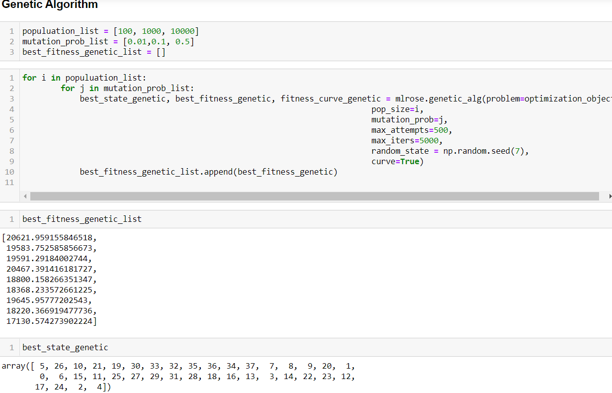

# 2) TSP Qatar 

## Problem Statement: What is the fastest way to move accross all 194 cities in Qatar? My approach here is the same as the Djibouti. I have mereged some steps to try an avoid repetition and I'll reach the result step a bit quicker this time around

## Simulated Annealing and the Genetic algorithm are compared to see which gives the best fitness 

#####    Two types of cooling methods were used and compared (Exponential Decay and Arithmatic Decay) for simulated annealing. The best 
#####    fitness value yielded by the the two cooling methods (for simulated annealing) will be chosen and compared with the 
#####    best fitness value from the genetic algorithm. 

#####    I used jupyter notebook to run my code. 
 
 
 ### Step 1 - Importing the relevant packages and data Preparation is done in this step. TSP file stored in a dictonary, then the coordinates stored in a list and then eventually an 'optimization object' is defined to be used later for different methods/algos  
 ###### Figure 2 - Jupyter Notebook Image of some data preparation lines. 
   
   
   
 ### Step 2 - Parameters are Initialized next.Simmulated Annealing algorithm was run on both the cooling methods, Exponential Decay as well as Arithmatic Decay. Necessary Variables were created and appended in a list. These include the 'best_fitness'(a value indicating the fitness), 'best_state' (the order in which the city should be traversed in) and the 'fitness_curve' (can be plotted) that shows 
 ###### Figure 3 - Jupyter Notebook Image of Parameters Initialization and Simulated Algorithm being run
   
 
 
   
 ### Step 5 - The Results of the simulated annealing are observed and compared. Firstly the minimum of the 24 fitness values for both exponential decay and arthimatic decay are compared. As we can see from the results the fitness value of yielded by simulated annealing with exponential decay cooling method (31835.54184048411) is GREATER than that yielded from the arthmatic decay cooling method(31209.37088676701). This is different to the Djibouti problem as you can see. Hence the conclusion is drawn that the minimum of the arithmatic decay value will be used to compare with the result from the genetic algorithm later. The index (21) of the minimum value (from a list of 24 fitness values of ARITHMATIC decay) is noted and used to pull out the list from the "best_state_arithmatic_list" (the order in which the cities should be traversed) and plot the fitness curve too. The minimum of the "best_fitness_arithmatic_list" is computed and compared with the minimum of the exp list and we can see below the min value from the exp list is GREATER than the min value from the arithmatic list so we choose the min value of the arithmatic list. Results and the plot are seen below. 
 ###### Figure 5 - Comparing the results of simulated annealing for both the cooling methods. 
   

### Step 6 - The Genetic Algorithm was run next with three values each for the two parameters that are population and mutation probablitiy. The algorithm will be run 9 times (3x3) and you can see the minimum value for the best_fitness is 17130.. which is way above the one we got from Simulated annealing. Hence it is better to use simulated annealing with exponential cooling to optimize this TSP problem
###### Figure 5 - Genetic Algorithm and its results. 
  

